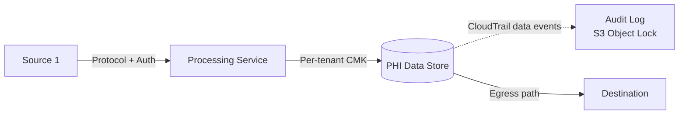
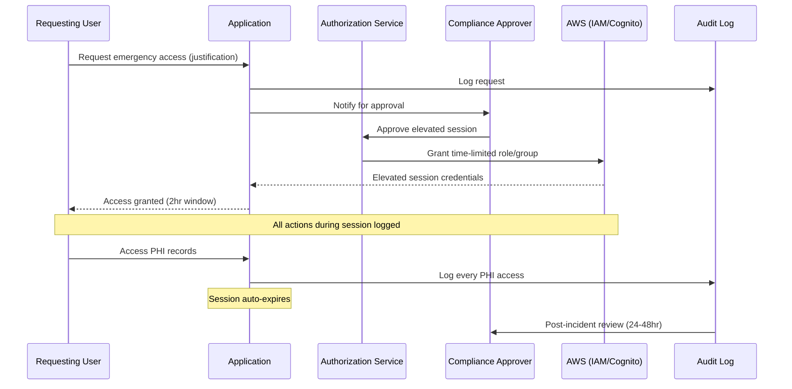

# Healthcare Architecture Artifacts

## Overview

This file covers healthcare-specific artifacts that complement the core SaaS artifacts. Offer these when the conversation involves PHI, HIPAA, FHIR, or healthcare-specific compliance (HITRUST, 42 CFR Part 2, FDA/SaMD).

It also covers **GxP artifacts** (GAMP 5 Categorization, Validation Plan, Traceability Matrix, Supplier Qualification Register, Electronic Signature Design, Change Control Record) for healthcare SaaS that is also life-sciences-regulated — SaMD, eClinical, pharmacovigilance, regulated labs. For the full GxP framework (ALCOA+, change management, validation methodology), load `gxp-compliance-generic.md`.

**Prerequisite:** Load `artifacts-saas.md` for foundational artifacts (Tenant Isolation Matrix, Data Partitioning Map, etc.), the shared "Artifact Readiness: Progressive Discovery" rules, and the "Agent Behavior for Artifacts" section. Those rules apply to healthcare and GxP artifacts too — this file only adds healthcare-specific and GxP-specific templates and readiness requirements.

Default save location: `docs/saas-architecture/` in the workspace root.

## Healthcare Artifact Relationships

**HIPAA Service Eligibility Matrix ↔ Tenant Isolation Matrix:**
The eligibility matrix validates that every AWS service in the isolation matrix is HIPAA-eligible. Generate them together or eligibility matrix first. If the isolation matrix references a non-eligible service for PHI, flag it immediately.

**PHI Data Flow Map ↔ Tenant Isolation Matrix:**
The PHI flow map shows data movement; the isolation matrix shows per-service isolation. The flow map should reference the isolation matrix for tenancy model and focus on the data journey (ingress → processing → storage → egress) with encryption and audit at each hop.

**PHI Data Flow Map ↔ Audit Log Coverage Matrix:**
Every PHI touchpoint in the flow map should have a corresponding entry in the audit log matrix. Cross-reference to find gaps — if PHI passes through a service that isn't in the audit matrix, that's a finding.

**BAA Inventory ↔ HIPAA Service Eligibility Matrix:**
The BAA inventory covers the contractual layer; the eligibility matrix covers the technical layer. Both should reference the same set of services. If a service is in the eligibility matrix but not in the BAA inventory, the BAA may not be in place.

**Break-the-Glass Runbook ↔ Audit Log Coverage Matrix:**
Break-the-glass events must be logged. The runbook should reference the audit matrix for where these logs go and how they're reviewed.

**De-identification Strategy ↔ PHI Data Flow Map:**
De-identification applies at specific points in the PHI flow. The strategy should reference the flow map for where de-identification happens.

**HITRUST Control Inheritance Matrix → standalone** but should reference the HIPAA Service Eligibility Matrix for which AWS services are in scope for the assessment.

## GxP Artifact Relationships

**GAMP 5 Service Categorization Matrix ↔ Supplier Qualification Register:**
The categorization matrix sets scope — every Category 3/4/5 component needs a supplier register entry. Generate the categorization first; the register references it.

**GAMP 5 Service Categorization Matrix ↔ Validation Plan:**
The categorization determines validation effort per component (Cat 1: minimal, Cat 5: full lifecycle). The Validation Plan consumes the matrix and defines IQ/OQ/PQ per component.

**Validation Plan ↔ Traceability Matrix:**
The Validation Plan defines what to validate; the Traceability Matrix proves coverage (requirement → test → result). Generate together or validation plan first.

**Electronic Signature Design ↔ Audit Log Coverage Matrix:**
Every e-signature event generates an audit log entry. The audit coverage matrix must include E_SIGNATURE_APPLIED events with the signature-specific fields.

**Electronic Signature Design ↔ Change Control Record Template:**
Approvals in the CCR are typically e-signatures. The CCR template references the e-signature design for how approvals are captured.

**Change Control Record ↔ Traceability Matrix:**
Every change affecting requirements flows from the CCR into the Traceability Matrix. Closed CCRs produce updated traceability entries.

**GAMP 5 Service Categorization Matrix ↔ HIPAA Service Eligibility Matrix:**
Both cover AWS services. For GxP+HIPAA systems, generate both — HIPAA Eligibility covers BAA/PHI eligibility, GAMP 5 covers validation scope. They should reference the same service list.


## Artifact 8: HIPAA Service Eligibility Matrix

Generate this after AWS service selection for any healthcare SaaS.

### Template

```markdown
# HIPAA Service Eligibility Matrix

**Product:** {product name}
**Date:** {date}
**AWS BAA Status:** {Executed / Not Executed / Unknown}

## Service Eligibility

| Service | HIPAA Eligible | Handles PHI | Encryption at Rest | Encryption in Transit | Audit Logging | KMS Key Type | Notes |
|---------|---------------|-------------|-------------------|----------------------|---------------|-------------|-------|
| {service} | Yes/No | Yes/No | {SSE-KMS / SSE-S3 / AES-256 / N/A} | {TLS 1.2+ / N/A} | {CloudTrail / CloudWatch / Custom} | {Per-tenant CMK / Shared CMK / AWS-managed} | {any caveats} |

## Non-Eligible Services in Use

| Service | Current Use | PHI Exposure Risk | Remediation |
|---------|------------|-------------------|-------------|
| {service} | {what it's used for} | {High/Medium/Low} | {Replace with eligible alternative / Ensure no PHI touches this service} |

## BAA Coverage Verification
- [ ] AWS BAA executed for this account
- [ ] All PHI-handling services are on the HIPAA Eligible Services list
- [ ] Encryption at rest enabled on all PHI data stores
- [ ] Encryption in transit enforced on all PHI transmission paths
- [ ] Audit logging enabled for all PHI-handling services

## Verification Date
Last verified against AWS HIPAA Eligible Services list: {date}
List URL: https://aws.amazon.com/compliance/hipaa-eligible-services-reference/
```

### When to Generate
- After selecting AWS services for a healthcare SaaS
- During architecture review when HIPAA compliance is in scope
- When adding a new AWS service to an existing healthcare SaaS

### Readiness Requires
- List of AWS services in use or planned
- Which services handle PHI (directly or indirectly)
- AWS BAA execution status

## Artifact 9: PHI Data Flow Map

Generate this after data partitioning discussion for healthcare SaaS.

### Template

```markdown
# PHI Data Flow Map

**Product:** {product name}
**Date:** {date}

## PHI Ingress Points

| Ingress | Source | Protocol | PHI Types | Encryption | Auth | Audit |
|---------|--------|----------|-----------|------------|------|-------|
| {e.g., Patient API} | {Patient app} | {HTTPS} | {Demographics, conditions} | {TLS 1.2} | {Cognito JWT} | {CloudTrail + app log} |
| {e.g., FHIR endpoint} | {EHR system} | {HTTPS + SMART on FHIR} | {Clinical records} | {TLS 1.2} | {SMART token} | {HealthLake audit} |
| {e.g., DICOM receiver} | {Imaging modality} | {DICOMweb / DIMSE} | {Medical images + metadata} | {TLS / VPN} | {Certificate} | {CloudTrail} |

## PHI Processing Steps

| Step | Service | Input PHI | Output PHI | Encryption | Tenant Isolation | Audit |
|------|---------|-----------|------------|------------|-----------------|-------|
| {e.g., NLP extraction} | {Comprehend Medical} | {Clinical notes} | {Extracted entities} | {In-transit: TLS} | {Per-request, no persistent storage} | {CloudTrail} |

## PHI Storage

| Data Store | Service | PHI Types | Encryption at Rest | KMS Key | Tenant Isolation | Backup | Retention |
|-----------|---------|-----------|-------------------|---------|-----------------|--------|-----------|
| {e.g., Patient records} | {HealthLake} | {FHIR resources} | {SSE-KMS} | {Per-tenant CMK} | {Data store per tenant} | {HealthLake export} | {Per policy} |

## PHI Egress Points

| Egress | Destination | Protocol | PHI Types | Encryption | Auth | Audit |
|--------|------------|----------|-----------|------------|------|-------|
| {e.g., Patient data export} | {Patient app} | {HTTPS} | {Patient's own records} | {TLS 1.2} | {Cognito JWT + consent} | {App log + CloudTrail} |

## De-identification Points
| Where | Method | Purpose |
|-------|--------|---------|
| {e.g., Analytics pipeline} | {Safe Harbor via Comprehend Medical} | {Population health analytics} |

## PHI Flow Diagram

{Generate a Mermaid flowchart showing the complete PHI journey — ingress points, processing steps, storage, egress, and de-identification. Annotate each hop with encryption method and audit source. Example structure:


}

## Related Artifacts
<!-- Reference tenant-isolation-matrix.md for per-service tenancy model -->
<!-- Reference audit-log-coverage-matrix.md for logging details at each hop -->
```

### When to Generate
- After data partitioning discussion for healthcare SaaS
- When a compliance officer asks "where does PHI flow in your system?"
- During HITRUST assessment preparation

### Readiness Requires
- List of services and data flow between them
- PHI classification per data type
- Encryption configuration per service
- Tenant isolation mechanism per service

## Artifact 10: BAA Inventory

### Template

```markdown
# BAA Inventory

**Product:** {product name}
**Date:** {date}

## AWS BAA
- **Status:** {Executed / Not Executed}
- **Execution Date:** {date}
- **Account(s) Covered:** {list AWS account IDs}
- **Services in Scope:** All HIPAA Eligible Services used in these accounts

## Subprocessor BAAs

| Vendor/Service | Purpose | PHI Handled | BAA Status | BAA Date | Review Date |
|---------------|---------|-------------|------------|----------|-------------|
| {e.g., Twilio} | {SMS notifications} | {Phone numbers + appointment info} | {Executed} | {date} | {annual review date} |

## Customer BAAs (Your Tenants)
- **Template:** {Location of your BAA template}
- **Required for:** All tenants that are covered entities or business associates
- **Key terms:** {Data use limitations, breach notification timeline, termination provisions}

## BAA Gap Analysis
| Gap | Risk | Remediation |
|-----|------|-------------|
| {e.g., Error tracking service has no BAA} | {PHI in error reports} | {Replace with HIPAA-eligible alternative or ensure no PHI in error payloads} |
```

### When to Generate
- After vendor/service selection
- During HITRUST assessment preparation
- When onboarding enterprise tenants who ask about your BAA chain

### Readiness Requires
- List of all services/vendors handling PHI
- BAA status with AWS
- List of third-party services in the data flow


## Artifact 11: Audit Log Coverage Matrix

### Template

```markdown
# Audit Log Coverage Matrix

**Product:** {product name}
**Date:** {date}

## Infrastructure Audit Logs

| Log Source | Events Captured | Destination | Retention | Immutable | Encrypted |
|-----------|----------------|-------------|-----------|-----------|-----------|
| CloudTrail (mgmt) | All API calls | S3 + CloudWatch | {X years} | {S3 Object Lock} | {KMS} |
| CloudTrail (data) | S3/DynamoDB/KMS access | S3 | {X years} | {S3 Object Lock} | {KMS} |
| VPC Flow Logs | Network traffic | CloudWatch / S3 | {X years} | {S3 Object Lock} | {KMS} |

## Application Audit Logs

| Event Type | What's Logged | Destination | Retention | Immutable | Encrypted |
|-----------|--------------|-------------|-----------|-----------|-----------|
| PHI Access | User, tenant, resource ID, action, timestamp, consent status | {DynamoDB → S3} | {6+ years} | {S3 Object Lock} | {KMS} |
| PHI Modification | User, tenant, resource ID, old/new hash, timestamp | {DynamoDB → S3} | {6+ years} | {S3 Object Lock} | {KMS} |
| Break-the-Glass | Requester, justification, authorizer, resources accessed, duration | {DynamoDB → S3} | {6+ years} | {S3 Object Lock} | {KMS} |
| Consent Changes | Patient, tenant, consent type, old/new status, timestamp | {DynamoDB → S3} | {6+ years} | {S3 Object Lock} | {KMS} |

## Review Schedule
| Review Type | Frequency | Reviewer | Evidence Location |
|------------|-----------|---------|-------------------|
| Access review | Quarterly | {Security team} | {S3 bucket} |
| Break-the-glass review | Within 48 hours of event | {Compliance officer} | {Incident tracker} |
| Anomaly review | Continuous (automated) | {CloudWatch Alarms → PagerDuty} | {CloudWatch} |

## Gaps
| Gap | Risk | Remediation |
|-----|------|-------------|
| {e.g., No data events for DynamoDB} | {Cannot audit PHI access at item level} | {Enable CloudTrail data events for PHI tables} |
```

### When to Generate
- After observability discussion
- During HITRUST assessment preparation
- When an auditor asks "show me your audit trail"

### Readiness Requires
- List of services handling PHI
- Current logging configuration
- Retention requirements (HIPAA: 6 years minimum)

## Artifact 12: HITRUST Control Inheritance Matrix

### Template

```markdown
# HITRUST Control Inheritance Matrix

**Product:** {product name}
**Date:** {date}
**Target CSF Version:** {e.g., v11.2}

## Control Domains

| HITRUST Domain | Total Controls | AWS Inherited | Customer Responsible | Shared | Evidence Source |
|---------------|---------------|---------------|---------------------|--------|---------------|
| {e.g., Access Control} | {X} | {Y} | {Z} | {W} | {AWS SRM + customer policies} |

## Customer-Responsible Controls (Priority)

| Control ID | Control Description | Current Status | Gap | Remediation | Evidence |
|-----------|-------------------|---------------|-----|-------------|---------|
| {e.g., 01.a} | {Access control policy} | {Implemented / Partial / Not Implemented} | {description} | {action needed} | {where to find evidence} |

## AWS-Inherited Controls
Reference: AWS HITRUST SRM for CSF v11.2
These controls are satisfied by AWS infrastructure and can be inherited in your assessment.

## Assessment Timeline
| Phase | Duration | Activities |
|-------|----------|-----------|
| Scoping | {X weeks} | Define assessment boundary, identify controls |
| Implementation | {X weeks} | Close gaps in customer-responsible controls |
| Evidence Collection | {X weeks} | Gather evidence for all controls |
| Assessor Engagement | {X weeks} | Validated assessment with HITRUST assessor |
| Certification | {X weeks} | Submit to HITRUST, receive certification |
```

### When to Generate
- When HITRUST certification is a stated goal
- During compliance planning for enterprise health system sales

### Readiness Requires
- Target HITRUST CSF version
- AWS services in use
- Current security controls and policies

## Artifact 13: De-identification Strategy

### Template

```markdown
# De-identification Strategy

**Product:** {product name}
**Date:** {date}

## Datasets Requiring De-identification

| Dataset | Source | PHI Types | Intended Use | Method | AWS Service |
|---------|--------|-----------|-------------|--------|-------------|
| {e.g., Clinical notes for ML training} | {HealthLake} | {Names, dates, MRNs} | {Model training} | {Safe Harbor} | {Comprehend Medical} |

## De-identification Methods

### Safe Harbor (18 Identifiers)
- Identifiers removed: {list which of the 18 apply to your data}
- Removal method: {Comprehend Medical DetectPHI → mask/redact}
- Validation: {Manual review of sample, re-identification risk assessment}

### Expert Determination (if applicable)
- Expert: {Name/firm}
- Methodology: {Statistical analysis approach}
- Re-identification risk threshold: {< X%}

## Pipeline Architecture
{Description: source data → de-identification service → validation → de-identified data store}

## Validation and Monitoring
- Sample review: {X% of de-identified records manually reviewed per batch}
- Macie scanning: {Continuous scan of de-identified data stores to detect residual PHI}
- Re-identification risk: {Assessment frequency and methodology}

## Access Controls for De-identified Data
- Who can access: {Roles/teams}
- Where stored: {Separate S3 bucket / separate HealthLake data store}
- Re-linking prohibited: {Policy and technical controls preventing re-identification}
```

### When to Generate
- When analytics, research, or ML training on health data is discussed
- When dev/test environments need realistic data

### Readiness Requires
- Data types containing PHI
- Intended use of de-identified data
- Regulatory requirements (HIPAA Safe Harbor vs Expert Determination)


## Artifact 14: Break-the-Glass Runbook

### Template

```markdown
# Break-the-Glass Runbook

**Product:** {product name}
**Date:** {date}
**Last Tested:** {date}

## Purpose
Emergency access procedure for PHI when normal authentication/authorization is insufficient.

## Who Can Initiate
| Role | Authorization Required | Scope |
|------|----------------------|-------|
| {e.g., Attending physician} | {Self-authorized for own patients} | {Read-only, current tenant} |
| {e.g., System administrator} | {Compliance officer approval} | {Cross-tenant read, time-limited} |

## Procedure

### Step 1: Request
- User initiates break-the-glass through {application UI / API endpoint}
- User provides: justification, patient identifier, requested access scope
- System records: requester identity, timestamp, justification

### Step 2: Authorization
- {Automatic for self-authorized roles / Requires approval from compliance officer}
- Approval timeout: {X minutes — if no response, escalate to backup approver}

### Step 3: Access Grant
- System creates time-limited elevated session: {duration, e.g., 2 hours}
- Session grants: {specific permissions, e.g., read-only access to specified patient records}
- Tenant boundary: {within-tenant only / cross-tenant if justified}
- Implementation: {Cognito temporary group + IAM session policy with expiration}

### Step 4: Monitoring
- All actions during elevated session logged with event_type: BREAK_THE_GLASS
- Real-time notification sent to: {compliance team, tenant admin, requester's supervisor}
- Session auto-expires after {duration}

### Step 5: Post-Incident Review
- Compliance team reviews within {24-48 hours}
- Review checklist:
  - [ ] Was the access justified?
  - [ ] Was only necessary data accessed?
  - [ ] Was the session duration appropriate?
  - [ ] Were any anomalies detected?
- Review documented in: {incident tracking system}

## Procedure Diagram

{Generate a Mermaid sequence diagram showing the break-the-glass flow from request through post-incident review. Example:


}

## Audit Trail
All break-the-glass events are logged to: {audit log destination}
Retention: {6+ years per HIPAA}
Immutability: {S3 Object Lock, Compliance Mode}

## Testing
- Frequency: {Quarterly}
- Test scenario: {Simulated emergency with test tenant/patient}
- Last test result: {Pass/Fail, date, findings}
```

### When to Generate
- After access control discussion
- When HITRUST assessment requires documented emergency access procedures
- When enterprise tenants ask about emergency access capabilities

### Readiness Requires
- Access control model (who has what permissions normally)
- Identity provider configuration
- Audit logging configuration
- Compliance team structure

## Healthcare Artifact Readiness (Additional Checks)

## GxP Artifacts (for SaMD and Regulated Healthcare SaaS)

Offer these when the conversation involves SaMD, eClinical, pharmacovigilance, regulated labs, or any GxP context. For the full GxP framework (ALCOA+, change management, validation), load `gxp-compliance-generic.md`.

### Artifact 15: GAMP 5 Service Categorization Matrix

Generate this early in architecture work for any GxP-regulated system. It bounds the validation effort and is referenced by most other GxP artifacts.

#### Template

```markdown
# GAMP 5 Service Categorization Matrix

**Product:** {product name}
**Date:** {date}
**GxP Regulatory Scope:** {SaMD / eClinical / pharmacovigilance / regulated lab / other}
**Software Safety Classification (IEC 62304):** {Class A / B / C — per component if different}

## Component Categorization

| Component | AWS Service(s) | GAMP Category | Safety Class | Validation Scope | Supplier | Version |
|-----------|---------------|---------------|--------------|------------------|----------|---------|
| {name} | {services used} | 1/3/4/5 | A/B/C | {Minimal/IQ/IQ+OQ/IQ+OQ+PQ/Full lifecycle} | {AWS / vendor / internal} | {pinned version} |

## Category Definitions Applied

### Category 1 (Infrastructure)
Components and their validation approach:
{list components + "inherit AWS qualification via GxP whitepaper; verify configuration via IaC"}

### Category 3 (Non-configured products)
Components and their validation approach:
{list + "IQ/OQ — verify deployed configuration matches specification"}

### Category 4 (Configured products)
Components and their validation approach:
{list + "IQ/OQ/PQ — validate configuration and operational behavior"}

### Category 5 (Custom applications)
Components and their validation approach:
{list + "Full lifecycle — URS, FS, DS, build, IQ, OQ, PQ"}

## Validation Effort Summary
- Total Category 5 components: {count}
- Total Category 4 components: {count}
- Total Category 3 components: {count}
- Total Category 1 components: {count}

## Isolation of Regulated vs Non-Regulated Components
{Describe how Class A/B/C components are architecturally separated so that changes to non-regulated components don't require revalidation of regulated ones}

## Related Artifacts
<!-- Reference supplier-qualification-register.md for Category 4/5 supplier details -->
<!-- Reference validation-plan.md for detailed validation approach per category -->
```

#### When to Generate
- At the start of architecture work for any GxP-regulated system
- When considering adoption of a new AWS service for a regulated component
- During validation planning

#### Readiness Requires
- Confirmed GxP applicability (what regulation applies and why)
- IEC 62304 software safety classification complete (if SaMD)
- List of AWS services and custom components

### Artifact 16: Validation Plan (IQ/OQ/PQ Strategy)

#### Template

```markdown
# Validation Plan

**Product:** {product name}
**Release Version:** {version being validated}
**Date:** {date}
**Validation Lead:** {name}
**QA Approver:** {name}

## Validation Scope

**In scope:**
{list components, features, integrations}

**Out of scope:**
{list what is excluded and why}

## Risk-Based Validation Approach (GAMP 5)

| Component | GAMP Category | Risk (Patient Safety / Data Integrity / Product Quality) | Validation Effort |
|-----------|---------------|--------------------------------------------------------|-------------------|
| {component} | {1/3/4/5} | High / Medium / Low | {description} |

## Validation Activities

### Installation Qualification (IQ)
**Objective:** Verify the system is installed/deployed as specified.

| IQ Test | Method | Evidence | Acceptance Criteria |
|---------|--------|----------|--------------------|
| IaC plan matches design | {Terraform/CDK plan output} | {S3 path} | No unexpected changes in plan |
| All services deployed | {Config / AWS CLI query} | {S3 path} | All specified resources present |
| Encryption enabled | {Config rule / Security Hub} | {S3 path} | All PHI stores encrypted with KMS |
| Audit logging enabled | {Config rule} | {S3 path} | CloudTrail + data events enabled |

### Operational Qualification (OQ)
**Objective:** Verify the system operates correctly within defined parameters.

| OQ Test | Method | Evidence | Acceptance Criteria |
|---------|--------|----------|--------------------|
| {test description} | {automated test / manual procedure} | {report location} | {pass criteria} |

### Performance Qualification (PQ)
**Objective:** Verify the system performs as expected under production-representative conditions.

| PQ Test | Method | Evidence | Acceptance Criteria |
|---------|--------|----------|--------------------|
| {e.g., FHIR API latency under load} | {load test} | {S3 path} | p99 < 500ms |
| {e.g., AI inference accuracy on golden dataset} | {automated test} | {S3 path} | ≥ {threshold}% accuracy |
| {e.g., Tenant isolation verified} | {automated test} | {S3 path} | Zero cross-tenant access |

## Traceability
Requirements Source: {URS / PRD location}
Traceability Matrix: {location of traceability matrix artifact}

## Deviations
{Expected deviations process; severity thresholds; escalation path}

## Validation Summary Report
Will be produced after validation execution at: {location}

## Approval
- Validation Lead: {name, date}
- QA: {name, date}
- Regulatory Affairs (if applicable): {name, date}
```

#### When to Generate
- Before validation execution for any regulated release
- When establishing the validation approach for a new GxP system

#### Readiness Requires
- GAMP 5 Service Categorization Matrix (prerequisite)
- URS and FS available
- Risk analysis complete

### Artifact 17: Traceability Matrix

#### Template

```markdown
# Traceability Matrix

**Product:** {product name}
**Release Version:** {version}
**Date:** {date}

## Requirements to Design to Test Traceability

| Req ID | Requirement (URS) | Design (FS/DS) | Test Case(s) | Test Result | Evidence | Status |
|--------|------------------|----------------|--------------|-------------|----------|--------|
| REQ-001 | {user requirement} | {FS/DS reference} | TC-001, TC-002 | Pass/Fail | {S3 path} | Complete/Open |

## Coverage Analysis

| Source | Total | Traced | Untraced |
|--------|-------|--------|----------|
| User Requirements | {count} | {count} | {count — must be zero before release} |
| Functional Specifications | {count} | {count} | {count} |
| Test Cases | {count} | {count} | {count — untraced tests may indicate gaps} |

## Regulatory Requirement Mapping

For each regulatory requirement, which user requirements address it?

| Regulation | Requirement | Addressed by REQ IDs |
|-----------|-------------|---------------------|
| 21 CFR Part 11 §11.10(a) | Validation of systems | REQ-VAL-001, REQ-VAL-002 |
| 21 CFR Part 11 §11.10(e) | Audit trails | REQ-AUDIT-001 through REQ-AUDIT-010 |
| 21 CFR Part 11 §11.200 | Electronic signatures | REQ-SIG-001 through REQ-SIG-005 |
| HIPAA §164.312(b) | Audit controls | REQ-AUDIT-001, REQ-AUDIT-011 |
| {additional regulations} | ... | ... |

## Gaps and Actions

| Gap | Risk | Action | Owner | Due |
|-----|------|--------|-------|-----|
| {untraced requirement or uncovered regulation} | {risk} | {remediation} | {name} | {date} |
```

#### When to Generate
- Before every regulated release as validation evidence
- During FDA submission preparation
- Prior to internal or external audits

#### Readiness Requires
- URS exists and is version-controlled
- Test cases exist and are linked to requirements in your tooling (Jira, Polarion, Jama, etc.)
- Test execution has run and results are available

### Artifact 18: Supplier Qualification Register

#### Template

```markdown
# Supplier Qualification Register

**Product:** {product name}
**Date:** {date}
**Quality System Owner:** {name or role}

## AWS as Primary Cloud Supplier

| Service | Region(s) | GAMP Category | Risk Impact | Qualification Evidence | Qualified Date | Review Date |
|---------|-----------|---------------|-------------|----------------------|----------------|-------------|
| Amazon S3 | {regions} | 1 | Direct (PHI storage) | AWS GxP whitepaper, HIPAA BAA, SOC 2 report | {date} | {date} |
| AWS KMS | {regions} | 1 | Direct (encryption) | AWS GxP whitepaper, FIPS 140-2 validation | {date} | {date} |
| Amazon HealthLake | {regions} | 4 | Direct (FHIR data) | AWS GxP whitepaper, HIPAA BAA, internal config validation | {date} | {date} |
| Amazon Bedrock | {regions} | 4 | Direct (clinical AI) | AWS GxP whitepaper, HIPAA BAA, model supplier attestations | {date} | {date} |
| {additional services} | ... | ... | ... | ... | ... | ... |

## AWS Shared Responsibility Acknowledgment
- AWS qualifies: physical infrastructure, hypervisor, managed service internals, regional SOC/ISO controls
- Customer qualifies: service configuration, IAM, data handling, application code, operational procedures
- Evidence: AWS SOC 2, ISO 27001, HIPAA BAA, GxP on AWS whitepaper
- Review frequency: Annually and upon major AWS service changes

## Third-Party Suppliers (Non-AWS)

| Component | Supplier | Version | GAMP Category | Risk Impact | Qualification Evidence | Qualified Date | Review Date |
|-----------|----------|---------|---------------|-------------|----------------------|----------------|-------------|
| {component} | {vendor} | {pinned version} | 1/3/4/5 | Direct/Indirect/None | {audit report, documentation review, test results} | {date} | {date} |

## Foundation Model Suppliers (for AI Systems)

| Model | Provider | Version | Hosting | HIPAA BAA | Validation Evidence | Qualified Date |
|-------|----------|---------|---------|-----------|--------------------|----------------|
| {model name} | {Anthropic / AWS / etc.} | {version} | {Bedrock region} | Yes/No | {validation test results on golden dataset} | {date} |

## Open Source Components

| Component | Version | License | GAMP Category | CVE Monitoring | Qualified Date |
|-----------|---------|---------|---------------|----------------|----------------|
| {package} | {pinned version} | {license} | 1/3 | {Dependabot / Snyk / other} | {date} |

## Review Schedule
| Review Type | Frequency | Owner |
|------------|-----------|-------|
| AWS services | Annual + upon major change | QA + Engineering |
| Critical third parties (Category 4/5 impact) | Annual | QA + Regulatory |
| Low-risk third parties (Category 1 impact) | Biennial | QA |
| Open source | Continuous (CVE) + annual review | Engineering |
```

#### When to Generate
- Before first regulated release (initial qualification)
- When adopting a new AWS service or third-party component
- Before audits or FDA submissions
- Annually as part of supplier review

#### Readiness Requires
- GAMP 5 Service Categorization Matrix (prerequisite)
- AWS BAA status confirmed
- List of all third-party dependencies (from dependency manifest)
- Model provider BAA/attestation for AI components

### Artifact 19: Electronic Signature Design

Generate this when 21 CFR Part 11 or Annex 11 electronic signatures apply (batch release, clinical report approval, regulated lab result verification, deployment approval for regulated releases).

#### Template

```markdown
# Electronic Signature Design

**Product:** {product name}
**Date:** {date}
**Applicable Regulation:** {21 CFR Part 11 / EU Annex 11 / both}

## Predicate Rules Requiring Signatures

| Event | Predicate Rule | Signature Meaning | Signer Role |
|-------|---------------|-------------------|-------------|
| {e.g., Clinical report finalization} | {regulation section} | "Approved" | Attending physician |
| {e.g., Batch release} | {regulation section} | "Released for distribution" | QP |
| {e.g., Production deployment} | {internal SOP} | "Approved for release" | QA Lead |

## Signature Type

| Signature | Type | Rationale |
|-----------|------|-----------|
| {event} | Non-biometric (credential) / Biometric / Digital (PKI) | {why this type is appropriate} |

## Signature Flow

### Step 1: Signing Request
- Trigger: {what initiates the signing flow}
- Pre-conditions: {record is ready for signing, user has role, etc.}
- Record content hash computed: SHA-256 over {canonical record representation}

### Step 2: Re-authentication
- Method: {MFA challenge / fresh JWT / continuous session validation}
- Timeout: {how recent the authentication must be}
- If session not fresh: redirect to re-authentication flow

### Step 3: Signature Record Creation
```
{
  "signature_id": "uuid",
  "signer_id": "{from re-auth}",
  "signer_printed_name": "{from IdP}",
  "signed_at": "{UTC timestamp}",
  "meaning": "{approved / reviewed / authored / etc.}",
  "record_id": "{record being signed}",
  "record_content_hash": "sha256:...",
  "signature_hash": "sha256({signer_id}+{signed_at}+{meaning}+{record_content_hash})",
  "kms_key_id": "{key used for signature}",
  "kms_signature": "{asymmetric KMS signature — if PKI type}"
}
```

### Step 4: Binding to Record
- Signature stored in: {record metadata / separate signature table with FK to record}
- Binding enforcement: {record content_hash verified on every read; mismatch marks signature invalid}
- Immutability: {S3 Object Lock on signature store, or append-only DynamoDB}

### Step 5: Audit Log
- Event type: E_SIGNATURE_APPLIED
- Fields: {as per audit schema, plus signature_id, meaning, record_content_hash}

## Signature Verification

Process for verifying a signature at any time:
1. Retrieve record + signature
2. Recompute record_content_hash from current record
3. Compare with signature.record_content_hash
4. If match: signature valid; if mismatch: record has been modified since signing

## Signature Invalidation
When a record is amended after signing:
- Signature is marked invalid (reason recorded)
- New signature required to re-approve
- Prior signature retained in audit history (never deleted)

## Signature Flow Diagram

{Generate a Mermaid sequence diagram showing: Requester → Application → IdP (re-auth) → Signing Service → KMS (if PKI) → Record Store → Audit Log}

## Related Artifacts
<!-- Reference audit-log-coverage-matrix.md for how signature events are logged -->
<!-- Reference break-the-glass-runbook.md if emergency signature override is defined -->
```

#### When to Generate
- When predicate rules require electronic signatures
- During validation planning for regulated releases
- When designing approval workflows for SaMD, eClinical, or regulated lab results

#### Readiness Requires
- Identified predicate rules requiring signatures
- Decision on signature type (non-biometric / biometric / digital)
- Identity provider configuration supporting re-authentication

### Artifact 20: Change Control Record Template

#### Template

```markdown
# Change Control Record

**CCR ID:** CCR-{year}-{number}
**Date Submitted:** {date}
**Status:** Draft / Pending Approval / Approved / In Implementation / Verification / Closed / Rejected

## Change Description
{What is changing}

## Rationale
{Why this change is needed}

## Classification
- [ ] Standard (pre-approved, automated)
- [ ] Normal (peer review + lead approval)
- [ ] Major (CAB approval required)
- [ ] Emergency (expedited, post-hoc review)

## Affected Components

| Component | GAMP Category | Current Version | New Version | Safety Class |
|-----------|---------------|-----------------|-------------|--------------|
| {component} | 1/3/4/5 | {version} | {version} | A/B/C |

## Impact Assessment

### Validation Impact
- [ ] No revalidation required
- [ ] Targeted revalidation (specific tests only): {list}
- [ ] Full revalidation required

### Risk Impact (ISO 14971)
- New hazards introduced: {yes/no + description}
- Existing hazards affected: {yes/no + description}
- Risk acceptance updated: {yes/no}

### Regulatory Impact
- [ ] No FDA notification/submission required
- [ ] Letter to file
- [ ] Special 510(k)
- [ ] New 510(k) / De Novo required
- [ ] Within approved PCCP scope (for AI retraining)

### Customer Impact
- [ ] Transparent to customer
- [ ] Customer notification required (specify timeline)
- [ ] Customer training required

## Implementation Plan

| Step | Owner | Due Date | Evidence |
|------|-------|----------|----------|
| {step} | {name} | {date} | {link to evidence after completion} |

## Testing Plan
{Tests to be executed to verify the change}

## Rollback Plan
{How to revert if the change causes issues in production}

## Approvals

| Role | Name | Decision | Date | Electronic Signature ID |
|------|------|----------|------|------------------------|
| Requester | {name} | Submitted | {date} | - |
| Technical Lead | {name} | {Approve/Reject} | {date} | {sig ID} |
| QA | {name} | {Approve/Reject} | {date} | {sig ID} |
| Regulatory (if applicable) | {name} | {Approve/Reject} | {date} | {sig ID} |
| CAB (if major change) | {name} | {Approve/Reject} | {date} | {sig ID} |

## Implementation Evidence
{Links to: commit SHA, PR, test results, deployment logs, validation evidence}

## Verification
- [ ] Change implemented as planned
- [ ] Tests executed and passed
- [ ] Production behavior verified
- [ ] Rollback tested (for major changes)
- [ ] Documentation updated

## Closure
**Closed By:** {name}
**Closure Date:** {date}
**Closure Notes:** {final notes}
```

#### When to Generate
- Per change to a validated GxP system
- Before implementation of normal/major/emergency changes
- Automated CCRs may be generated from PR metadata for standard changes

#### Readiness Requires
- Change control process defined in SOPs
- CAB structure defined (for major changes)
- Electronic signature capability (per Artifact 19)

## GxP Artifact Readiness (Additional Checks)

**GAMP 5 Service Categorization Matrix** — requires: GxP regulatory scope confirmed, list of components available
**Validation Plan** — requires: GAMP 5 Categorization complete, URS/FS available, risk analysis complete
**Traceability Matrix** — requires: requirements in a traceability tool, test cases linked to requirements
**Supplier Qualification Register** — requires: GAMP 5 Categorization complete, AWS BAA status, dependency manifest
**Electronic Signature Design** — requires: predicate rules identified, signature type decided, IdP capability confirmed
**Change Control Record** — requires: change control SOP in place, approval roles defined

## Healthcare Artifact Readiness (Additional Checks)

The general "Artifact Readiness: Progressive Discovery" rules in `artifacts-saas.md` apply to all artifacts — healthcare included. Healthcare artifacts add these specific requirements:

**HIPAA Service Eligibility Matrix** — requires: AWS BAA execution status confirmed
**PHI Data Flow Map** — requires: PHI classification complete (which data types are PHI)
**BAA Inventory** — requires: complete list of third-party services in the data flow
**Audit Log Coverage Matrix** — requires: CloudTrail configuration details (which data events are enabled)
**HITRUST Control Inheritance Matrix** — requires: target CSF version confirmed, AWS SRM reviewed
**De-identification Strategy** — requires: intended use of de-identified data clearly defined
**Break-the-Glass Runbook** — requires: compliance team structure and approval chain defined

**The same hard rules apply:** Do not generate healthcare or GxP artifacts with placeholder content. If information is missing, ask for it. Every artifact must be specific enough that a compliance officer, QA lead, or regulatory affairs specialist can review it and take action.

## Healthcare Artifact Naming Convention

- HIPAA Eligibility Matrix: `docs/saas-architecture/hipaa-service-eligibility-matrix.md`
- PHI Data Flow Map: `docs/saas-architecture/phi-data-flow-map.md`
- BAA Inventory: `docs/saas-architecture/baa-inventory.md`
- Audit Log Coverage: `docs/saas-architecture/audit-log-coverage-matrix.md`
- HITRUST Control Inheritance: `docs/saas-architecture/hitrust-control-inheritance-matrix.md`
- De-identification Strategy: `docs/saas-architecture/de-identification-strategy.md`
- Break-the-Glass Runbook: `docs/saas-architecture/break-the-glass-runbook.md`
- GAMP 5 Service Categorization: `docs/saas-architecture/gamp5-service-categorization-matrix.md`
- Validation Plan: `docs/saas-architecture/validation-plan-{release}.md`
- Traceability Matrix: `docs/saas-architecture/traceability-matrix-{release}.md`
- Supplier Qualification Register: `docs/saas-architecture/supplier-qualification-register.md`
- Electronic Signature Design: `docs/saas-architecture/electronic-signature-design.md`
- Change Control Record Template: `docs/saas-architecture/change-control-record-template.md`
