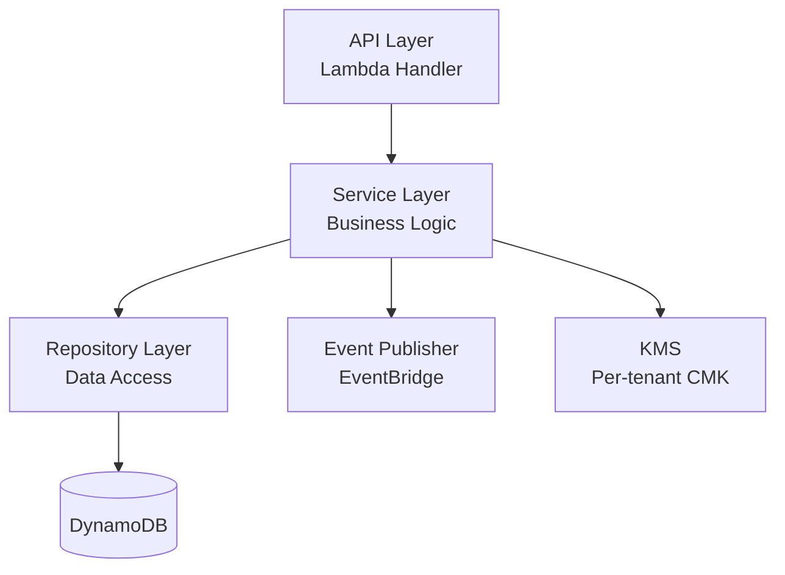
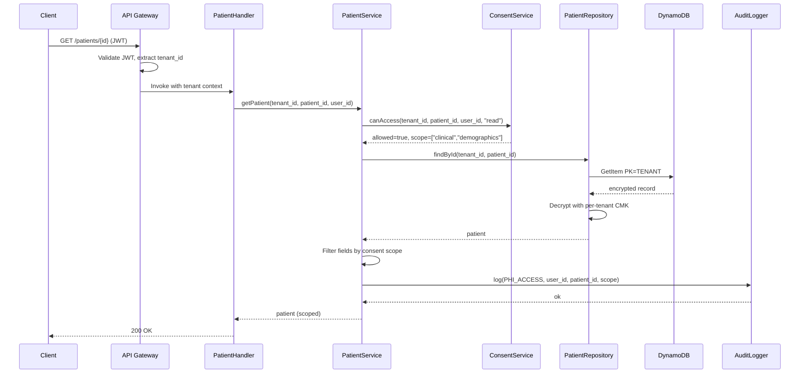

# Low-Level Design Artifact

## Overview

This file covers the **Low-Level Design (LLD)** artifact — a component-level design document that sits one layer below the High-Level Design (HLD). Where the HLD answers "what does the whole system look like?", the LLD answers "how is *this component* built?"

An LLD is the bridge between architecture and code. It documents the internal structure of a single component or bounded context: its classes/modules, public APIs, data models, key algorithms, sequence of interactions, error handling, and the specific AWS service configurations that make it work. It's what a developer reads before they write the first line of code, and what a reviewer reads to verify the code matches intent.

**One LLD per component, not one LLD per system.** A healthcare SaaS may have 10-20 LLDs across its services (e.g., one for the Patient Service, one for the FHIR ingestion pipeline, one for the Imaging orchestrator). Each is a focused document.

**Prerequisite:** Load `artifacts-saas.md` for the shared "Artifact Readiness: Progressive Discovery" rules and the "Agent Behavior for Artifacts" section. Those rules apply to LLDs too — this file only adds the LLD-specific template, readiness requirements, and relationships. The HLD template (Artifact 2 in `artifacts-saas.md`) is the parent document LLDs deepen.

**Also load** domain-specific steering files based on what the component does:
- Component handles PHI → `phi-data-handling.md`, `tenant-isolation.md`
- Component does FHIR/HL7 → `fhir-and-interop.md`
- Component does imaging/DICOM → `clinical-saas-and-imaging.md`
- Component does GenAI → `genai-and-phi.md`
- Component is GxP-regulated (SaMD, eClinical) → `gxp-compliance-generic.md`
- Component is on tenant lifecycle path → `identity-and-onboarding.md`, `sbt-toolkit.md`

Default save location: `docs/saas-architecture/lld/{component-name}.md` in the workspace root.

## LLD Artifact Relationships

**HLD ↔ LLD (most important):**
The HLD is the doorway; each LLD is the room behind a specific door. The HLD's "Components and Responsibilities" table lists components — each Category 4 or Category 5 component typically gets its own LLD. Every LLD must reference the HLD as its parent and cite the specific component it deepens. If the HLD doesn't exist yet, generate it first — an LLD without an HLD has no context for its constraints (tenancy model, regulatory scope, integration points).

**LLD ↔ Tenant Isolation Matrix:**
The Isolation Matrix says "Service X is pool/bridge/silo with isolation mechanism Y." The LLD implements that decision — it shows the specific IAM session policies, partition key design, or resource-per-tenant provisioning logic. The LLD references the Isolation Matrix row for its component; the Isolation Matrix doesn't change.

**LLD ↔ Data Partitioning Map:**
The Data Partitioning Map defines the tenant key design per storage service. The LLD shows how the component's code uses that key design — query patterns, access methods, index usage. Reference, don't duplicate.

**LLD ↔ PHI Data Flow Map:**
The PHI Flow Map shows how PHI moves across the system. The LLD shows how PHI is handled *inside* one component — field-level encryption, de-identification at boundaries, logging redaction, KMS key usage. If the component is a hop in the PHI Flow Map, the LLD proves that hop's controls are implemented.

**LLD ↔ ADRs:**
When an LLD makes a non-obvious design choice (a specific design pattern, a library selection, a data structure trade-off), that choice may warrant its own ADR. The LLD references the ADR for rationale rather than repeating it. Conversely, when an ADR decision affects a component, link to the relevant LLD so readers can see the implementation.

**LLD ↔ Audit Log Coverage Matrix:**
Every audit event the component emits should appear in the Audit Log Coverage Matrix. The LLD shows the code paths that emit those events. If the LLD adds a new audit event, the Audit Matrix must be updated in the same change.

**LLD ↔ GAMP 5 Service Categorization Matrix (GxP):**
For GxP systems, the categorization matrix classifies each component (Cat 3/4/5). The LLD's depth tracks the category: Cat 5 (custom) requires full design detail with traceability to requirements; Cat 4 (configured) requires configuration design with clear vendor-vs-customer boundaries. Reference the matrix row for the component.

**LLD ↔ Validation Plan and Traceability Matrix (GxP):**
Every LLD design element (class, method, configuration) that implements a requirement must be traceable in the Traceability Matrix. The LLD is the "Design Specification" layer in URS → FS → **DS** → code → test. Validation Plan OQ/PQ tests target LLD-level behavior.

**General rule:** An LLD exists to deepen *one* component. It must reference the HLD, the Isolation Matrix, the Data Partitioning Map, and any other artifacts that constrain the component — never re-derive those decisions.


## Artifact: Low-Level Design (LLD)

### Template

```markdown
# Low-Level Design: {Component Name}

**Parent System:** {product name} — see [High-Level Design](../high-level-design.md)
**Component:** {component name as it appears in the HLD}
**Owner:** {team or individual}
**Date:** {date}
**Version:** {version}
**Status:** Draft | Reviewed | Approved | Superseded

## 1. Purpose and Scope

### Purpose
{One paragraph, 3-5 sentences: what does this component do, why does it exist, and what responsibility does it own within the larger system? Write this for a developer joining the team who has read the HLD but hasn't touched this component.}

### Scope
**In scope for this LLD:**
- {behavior / API / data / integration}
- {behavior / API / data / integration}

**Out of scope (covered elsewhere):**
- {behavior} — see {LLD / artifact / steering file}
- {behavior} — see {LLD / artifact / steering file}

### Parent Context (from HLD)
- **Segment:** {segment from HLD}
- **Regulatory scope:** {HIPAA + additional as applicable}
- **Tenancy model for this component:** {Pool / Bridge / Silo} — see [Tenant Isolation Matrix](../tenant-isolation-matrix.md)
- **GAMP 5 category (if GxP):** {1/3/4/5} — see [GAMP 5 Service Categorization Matrix](../gamp5-service-categorization-matrix.md)
- **Safety class (if SaMD):** {A/B/C}

## 2. Component Architecture

### Internal Structure

{Describe the component's internal organization: layers, modules, packages, or classes. Include a Mermaid diagram.}



### Module/Class Responsibilities

| Module / Class | Responsibility | Key Dependencies |
|----------------|---------------|------------------|
| {e.g., `PatientHandler`} | {HTTP request parsing, tenant context extraction, response shaping} | `PatientService`, `TenantContext` |
| {e.g., `PatientService`} | {Business rules, consent checks, orchestration across repositories} | `PatientRepository`, `ConsentService`, `AuditLogger` |
| {e.g., `PatientRepository`} | {DynamoDB access with per-tenant partition key, optimistic locking} | DynamoDB client |
| {e.g., `ConsentService`} | {42 CFR Part 2 consent enforcement for SUD data} | `ConsentRepository` |
| {e.g., `AuditLogger`} | {Structured PHI access events to CloudWatch + S3} | CloudWatch Logs, S3 |

### Design Patterns Applied
{List patterns used and why. Examples: Repository (separate data access from business logic), Saga (distributed transaction with compensation), Circuit Breaker (external dependency isolation). Reference an ADR if the pattern choice was non-obvious.}

## 3. Public API (Contract)

### API Surface

{For HTTP APIs, document each endpoint. For event-driven components, document each event consumed and produced. For libraries, document each public function/class.}

#### Endpoint: `{HTTP method} {path}`
- **Purpose:** {what it does}
- **Authentication:** {Cognito JWT / SMART on FHIR / mTLS}
- **Authorization:** {required claims, tenant scope, tier gate}
- **Request schema:**
  ```json
  {
    "field": "type and description"
  }
  ```
- **Response schema (200):**
  ```json
  {
    "field": "type and description"
  }
  ```
- **Error responses:**
  | Status | Condition | Response body |
  |--------|-----------|---------------|
  | 400 | {validation failure} | `{"error": "...", "field": "..."}` |
  | 401 | {unauthenticated} | `{"error": "unauthorized"}` |
  | 403 | {unauthorized — wrong tenant, missing consent, tier limit} | `{"error": "forbidden", "reason": "..."}` |
  | 404 | {resource not found or not visible to this tenant} | `{"error": "not_found"}` |
  | 409 | {optimistic locking failure} | `{"error": "conflict"}` |
  | 429 | {throttled} | `{"error": "too_many_requests"}` |
- **Idempotency:** {Key header required? Deduplication window?}
- **Rate limit:** {per-tier, references Tiering Matrix}
- **SLA:** {p50, p99 latency targets}

{Repeat per endpoint.}

#### Events Consumed
| Event | Source | Purpose | Handler |
|-------|--------|---------|---------|
| `TenantOnboarded` | Control Plane EventBridge | {Trigger per-tenant resource provisioning} | `onTenantOnboarded` |

#### Events Published
| Event | Destination | Payload | Consumers |
|-------|------------|---------|-----------|
| `PatientRecordUpdated` | Application EventBridge | {tenant_id, patient_id, version, timestamp — no PHI} | {Analytics pipeline, Audit logger} |

## 4. Data Model

### Primary Data Store
- **Service:** {DynamoDB / RDS Aurora / HealthLake / S3}
- **Tenancy model for data:** {Pool with LeadingKeys / Bridge per-tenant table / Silo per-tenant data store}
- **KMS key:** {Per-tenant CMK / Shared CMK} — see [PHI Data Flow Map](../phi-data-flow-map.md)
- **Reference:** [Data Partitioning Map](../data-partitioning-map.md)

### Schema

{For DynamoDB:}
| Attribute | Type | Key | Description |
|-----------|------|-----|-------------|
| PK | String | Partition | `TENANT#{tenant_id}` |
| SK | String | Sort | `PATIENT#{patient_id}` |
| GSI1PK | String | GSI1 Partition | `TENANT#{tenant_id}#MRN` |
| GSI1SK | String | GSI1 Sort | `{mrn}` |
| version | Number | — | Optimistic locking token |
| phi_encrypted_blob | Binary | — | Envelope-encrypted with per-tenant CMK |
| created_at | String | — | ISO 8601 |
| updated_at | String | — | ISO 8601 |

{For RDS:}
```sql
CREATE TABLE patients (
  tenant_id       UUID NOT NULL,
  patient_id      UUID NOT NULL,
  mrn             TEXT,
  ...
  PRIMARY KEY (tenant_id, patient_id)
);
-- Row-level security ensures tenant_id matches current_setting('app.tenant_id')
CREATE POLICY tenant_isolation ON patients USING (tenant_id = current_setting('app.tenant_id')::uuid);
```

### Access Patterns

| Pattern | API / Use Case | Query | Consistency |
|---------|---------------|-------|-------------|
| Get patient by ID | `GET /patients/{id}` | `PK=TENANT#t, SK=PATIENT#p` | Strong |
| Search by MRN | `GET /patients?mrn=X` | GSI1 `GSI1PK=TENANT#t#MRN, GSI1SK=X` | Eventually consistent |
| List recent updates | Event publisher | Stream | — |

### PHI Field-Level Handling
| Field | PHI Classification | Encryption | Logging Treatment |
|-------|-------------------|------------|-------------------|
| `patient_name` | Direct identifier | Envelope w/ per-tenant CMK | Redacted in all logs |
| `mrn` | Direct identifier | Envelope w/ per-tenant CMK | Hashed in logs (for correlation) |
| `dob` | Direct identifier | Envelope w/ per-tenant CMK | Redacted (year only for debugging) |
| `condition_codes` | Clinical data | Envelope w/ per-tenant CMK | Redacted in logs |
| `tenant_id` | Not PHI | Not encrypted | Logged in every entry |

### Caching
- **What is cached:** {and why}
- **Where:** {Lambda memory / ElastiCache / DynamoDB DAX}
- **Tenant isolation of cache:** {key includes tenant_id, or cache is per-tenant}
- **PHI in cache:** {yes/no — if yes, encryption and TTL policy}
- **Invalidation:** {how stale data is prevented}

## 5. Key Interactions (Sequence Diagrams)

{One sequence diagram per significant flow — typically 2-4 per LLD. Focus on the flows that touch PHI, span services, or have non-trivial error handling.}

### Flow: {e.g., Read Patient Record with Consent Check}



### Flow: {e.g., Write Path with Optimistic Locking and Audit}
{another Mermaid diagram}

### Flow: {e.g., Break-the-Glass Read Path}
{another Mermaid diagram — references Break-the-Glass Runbook}

## 6. Tenant Isolation Implementation

### Context Propagation
- **Ingress:** `tenant_id` extracted from {JWT `custom:tenantId` claim / SMART on FHIR launch context}
- **In-process:** Passed explicitly on every call (no thread-local / ambient context — verifiable in review)
- **Egress (outbound calls):** Added to downstream requests as {header / message attribute / parameter}
- **Events:** `tenant_id` in every event payload (see §3 Events Published)
- **Logs:** `tenant_id` in every log entry (see §9 Observability)

### Enforcement Layer
{Describe how cross-tenant access is structurally prevented, not just filtered.}

- **IAM session policy:** {STS AssumeRole with `LeadingKeys` condition restricting DynamoDB access to `TENANT#{tenant_id}#*`} — see `tenant-isolation.md`
- **Repository-layer assertion:** Every query builder injects `tenant_id`; a query without a tenant filter throws at construction time (not at runtime).
- **Unit test:** {specific test name that proves cross-tenant rejection}

### Isolation Failure Modes and Mitigations
| Failure mode | Mitigation |
|--------------|-----------|
| Developer forgets to pass tenant_id | Repository interface requires it — compile-time failure |
| JWT claim mismatches request path | Handler validates path tenant matches JWT claim |
| GSI query bypasses LeadingKeys | IAM policy also applies to GSIs; tested |

## 7. Algorithms and Business Logic

{For any non-trivial algorithm, document it here. Include pseudocode, not library-specific code, unless the language is chosen and vetted.}

### Algorithm: {e.g., Consent-Scoped Field Projection}

**Input:** `patient_record`, `consent_scopes: Set<string>`
**Output:** `projected_record` with only fields permitted by `consent_scopes`

```
FUNCTION projectByConsent(record, scopes):
    result = {}
    FOR each field IN record:
        required_scope = FIELD_SCOPE_MAP[field]  // e.g., "dob" -> "demographics"
        IF required_scope IN scopes:
            result[field] = record[field]
        ELSE:
            // do not include; do not log; do not error
            CONTINUE
    RETURN result
```

**Complexity:** O(n) in number of fields.
**Invariants:**
- Output is always a subset of input (never adds fields).
- Missing consent never produces an error — it produces an omission, which must be auditable.
- `tenant_id` is never subject to projection.

**Edge cases:**
- Empty scopes → empty record (but not error).
- Unknown field in record → conservative default: exclude and log warning.
- Record contains a new field not in FIELD_SCOPE_MAP → fail closed (exclude); add to map in next release.

{Repeat per significant algorithm: consent evaluation, idempotency key generation, retry/backoff, de-duplication windows, ML inference pipelines, etc.}

## 8. Error Handling and Resilience

### Error Taxonomy

| Error Class | Example | Surface to Client | Retry? | Log Severity |
|-------------|---------|-------------------|--------|--------------|
| Validation | Missing required field | 400 | No | INFO |
| AuthN | Invalid/expired JWT | 401 | No (re-auth) | INFO |
| AuthZ | Cross-tenant / consent denied | 403 | No | WARN (potential probe) |
| NotFound | Patient doesn't exist for this tenant | 404 | No | INFO |
| Conflict | Optimistic lock failed | 409 | Yes (re-read) | INFO |
| Throttled | Per-tier rate limit hit | 429 | Yes (backoff) | INFO |
| Dependency | KMS / DynamoDB transient failure | 503 | Yes (bounded) | ERROR |
| Internal | Unexpected exception | 500 | No | ERROR (alert) |

### Retry and Backoff
- **Strategy:** Exponential backoff with jitter. Base: {100ms}, max: {5s}, attempts: {3}.
- **Idempotency:** Required for all retried operations — see idempotency key design in §3.
- **Circuit breaker:** {Opens after {N} consecutive failures to {dependency}, half-open after {timeout}}.

### Partial Failure Handling
{For multi-step operations, document the saga / compensation logic.}

- **Operation:** {e.g., patient onboarding across 3 downstream services}
- **On failure of step N:** {compensation actions for steps 1..N-1}
- **Audit trail:** {every step and compensation is logged}

## 9. Security and Compliance Implementation

### PHI Handling
- **Encryption at rest:** Envelope encryption with per-tenant CMK for PHI fields (see §4 Data Model).
- **Encryption in transit:** TLS 1.2+ on all ingress/egress; mTLS on {specific internal paths if any}.
- **Log redaction:** Structured logging with field allowlist; direct identifiers never logged in plaintext. See §9 Observability.
- **Error messages:** Must not leak PHI. Errors reference opaque IDs, not patient names/MRNs.

### AuthN / AuthZ
- **Authentication:** {Cognito JWT / SMART on FHIR / Cognito + SAML federation} — see `identity-and-onboarding.md`
- **Authorization model:** {RBAC / ABAC / scope-based}
- **Consent enforcement:** {Point at which consent is checked, and how consent cache is invalidated}
- **Break-the-glass:** {Supported? If yes, reference Break-the-Glass Runbook and show the elevated session handling}

### Audit Events Emitted
| Event | When | Fields | Destination |
|-------|------|--------|-------------|
| `PHI_ACCESS` | Every read of PHI fields | tenant_id, user_id, patient_id, fields_accessed, consent_scope, timestamp | CloudWatch → S3 (Object Lock, 7yr) |
| `PHI_MODIFICATION` | Every write to PHI fields | tenant_id, user_id, patient_id, field_hashes_before/after, timestamp | CloudWatch → S3 (Object Lock, 7yr) |
| `CONSENT_CHANGE` | Consent updated | tenant_id, patient_id, old_scope, new_scope, actor, timestamp | CloudWatch → S3 |
| `BREAK_THE_GLASS` | Emergency access invoked | tenant_id, requester, justification, scope, duration | CloudWatch → S3 + realtime notification |

All audit events appear in [Audit Log Coverage Matrix](../audit-log-coverage-matrix.md).

### Electronic Signatures (GxP components only)
{If the component handles 21 CFR Part 11 signatures:}
- **Signature binding:** {how the signature is cryptographically bound to the signed record}
- **Re-authentication at signing:** {yes — password + MFA re-entry, not just session token}
- **Signature record:** {fields captured: signer, meaning, timestamp, record hash}
- See [Electronic Signature Design](../electronic-signature-design.md).

## 10. Observability

### Structured Logging
- **Format:** JSON with fields: `timestamp`, `level`, `tenant_id`, `request_id`, `user_id`, `event`, `resource_id` (opaque), `duration_ms`
- **PHI rule:** Never log direct identifiers or clinical content. Use opaque IDs and hashes for correlation.
- **Log levels:**
  - `ERROR` — unexpected failures, alerting threshold
  - `WARN` — suspicious patterns (auth failures, consent denials, throttling)
  - `INFO` — normal request/response lifecycle
  - `DEBUG` — disabled in production; never contains PHI even when enabled

### Metrics (per-tenant)
| Metric | Unit | Dimensions | Alarm Threshold |
|--------|------|-----------|-----------------|
| `request_count` | count | tenant_id, endpoint, status | — |
| `request_latency` | ms (p50, p99) | tenant_id, endpoint | p99 > {X}ms sustained |
| `phi_access_count` | count | tenant_id | Anomaly detection (not fixed threshold) |
| `auth_failure_count` | count | tenant_id | > {X} in {Y} minutes → alert |
| `consent_denial_count` | count | tenant_id | Tracked for review |
| `dependency_error_rate` | % | tenant_id, dependency | > {X}% over {Y} minutes |

### Traces
- **Instrumentation:** {AWS X-Ray / OpenTelemetry}
- **Tenant propagation:** `tenant_id` added as trace annotation (searchable) but PHI fields never added as attributes.

### Health and Readiness
- **Health:** {endpoint returning 200 if process is alive}
- **Readiness:** {endpoint returning 200 only if dependencies (KMS, DynamoDB) are reachable}

## 11. Scaling and Performance

### Expected Load
- **Steady state:** {requests/sec, data volume}
- **Peak:** {requests/sec, duration, frequency}
- **Per-tenant skew:** {do some tenants generate 100x the average? how is noisy-neighbor handled?}

### Scaling Strategy
- **Compute:** {Lambda concurrency limits per-tier / ECS auto-scaling / EKS HPA}
- **Storage:** {DynamoDB on-demand vs provisioned, RDS read replicas, HealthLake FHIR quotas}
- **Noisy neighbor:** {per-tenant throttling at API Gateway usage plans — see Tiering Matrix}

### Performance Budget
| Operation | p50 | p99 | Notes |
|-----------|-----|-----|-------|
| Read patient | {X}ms | {Y}ms | Includes decryption |
| Write patient | {X}ms | {Y}ms | Includes encryption, audit emit |
| Consent check | {X}ms | {Y}ms | Cached; cold-path budget separate |

## 12. Testing Strategy

### Unit Tests
- **Coverage target:** {% — often driven by GAMP category or safety class}
- **Focus areas:** {business logic, algorithm correctness, consent evaluation, error taxonomy}
- **Framework:** {pytest / jest / junit / xunit}

### Integration Tests
- **Scope:** {component + its direct dependencies — DynamoDB Local, localstack, contract tests against downstreams}
- **Tenant isolation test suite:** {explicit tests that verify cross-tenant access is rejected — mandatory for any component handling PHI}

### Contract Tests
- **Consumers:** {list consumers of this component's API}
- **Providers:** {list services this component depends on}
- **Tool:** {Pact / openapi schema validation}

### End-to-End Test Hooks
- **Test tenants:** {non-PHI fixture tenants for synthetic traffic}
- **Test data:** {de-identified or synthetic — never production PHI}

### Performance Tests
- **Tool:** {k6 / Locust / Artillery}
- **Scenarios:** {baseline, peak, noisy-neighbor simulation}

## 13. Deployment and Operations

### Deployment
- **Artifact:** {Lambda zip / container image}
- **IaC:** {CDK stack / Terraform module} — path: `{path in repo}`
- **Rollout strategy:** {Canary / blue-green / all-at-once} — see `resilience-and-deployment.md`
- **Rollback:** {CodeDeploy alarm-triggered rollback / manual revert via IaC}

### Runbook References
- **On-call runbook:** {path or link}
- **Break-the-glass runbook:** [Break-the-Glass Runbook](../break-the-glass-runbook.md)
- **Disaster recovery:** {RPO, RTO for this component's data}

### Configuration
| Parameter | Default | Source | Environment Override |
|-----------|---------|--------|----------------------|
| {e.g., `CONSENT_CACHE_TTL`} | 300s | SSM Parameter Store | Allowed |
| {e.g., `MAX_RETRY_ATTEMPTS`} | 3 | SSM Parameter Store | Allowed |

Secrets (KMS key IDs, database credentials) are not in this LLD — see {Secrets Management artifact / runbook}.

## 14. Dependencies

### Internal
| Dependency | Purpose | Contract |
|-----------|---------|----------|
| {e.g., `ConsentService`} | {Per-request consent evaluation} | {API contract link or LLD link} |
| {e.g., `AuditLogger`} | {Structured audit emission} | {shared library} |

### External (AWS Services)
| Service | Purpose | HIPAA-eligible | Configuration notes |
|---------|---------|---------------|---------------------|
| DynamoDB | Primary data store | Yes | Per-tenant LeadingKeys IAM policy; encryption with per-tenant CMK |
| KMS | Envelope encryption | Yes | Per-tenant CMK; key policy restricts decrypt to this component's role |
| CloudWatch Logs | Audit + operational logs | Yes | Log group encryption with CMK |
| S3 | Audit log archive | Yes | Object Lock Compliance Mode, 7-year retention |
| EventBridge | Event publication | Yes | Dedicated bus; no PHI in event payloads |

### Third-Party Libraries
| Library | Version | Purpose | License | Supplier Qualification (GxP) |
|---------|---------|---------|---------|------------------------------|
| {library} | {pinned version} | {purpose} | {license} | {Cat 3/4 supplier register entry — GxP only} |

## 15. Open Questions and Risks

### Open Questions
| # | Question | Impact | Owner | Due |
|---|----------|--------|-------|-----|
| 1 | {unresolved design detail} | {H/M/L} | {name} | {date} |

### Known Risks
| # | Risk | Likelihood | Impact | Mitigation |
|---|------|-----------|--------|-----------|
| 1 | {risk description} | {H/M/L} | {H/M/L} | {mitigation} |

## 16. Related Artifacts and Decisions

- **Parent:** [High-Level Design](../high-level-design.md) — system view
- **Isolation model:** [Tenant Isolation Matrix](../tenant-isolation-matrix.md) — row for this component
- **Storage:** [Data Partitioning Map](../data-partitioning-map.md) — this component's storage detail
- **PHI flow (if applicable):** [PHI Data Flow Map](../phi-data-flow-map.md) — hops involving this component
- **Audit (if applicable):** [Audit Log Coverage Matrix](../audit-log-coverage-matrix.md) — audit events this component emits
- **Decisions:**
  | ADR | Topic | Link |
  |-----|-------|------|
  | ADR-00X | {decision affecting this component} | [ADR-00X](../adr/ADR-00X-{title}.md) |

## 17. Revision History

| Version | Date | Author | Change |
|---------|------|--------|--------|
| 1.0 | {date} | {name} | Initial version |
```

### GxP Variant — Additional Sections

For GxP-regulated components (SaMD, eClinical, pharmacovigilance, regulated labs), append these sections. They turn the LLD into a proper Design Specification (DS) that sits between Functional Specification and implementation, per GAMP 5 V-model.

```markdown
## 18. Software Safety Classification

**Component safety class (IEC 62304):** {A / B / C}

**Rationale:** {what harm to the patient could occur if this component fails — why this class}

**Risk control measures implemented in this component:**
| Hazard | Risk Control | Verification |
|--------|-------------|--------------|
| {e.g., Incorrect consent evaluation leading to unauthorized PHI disclosure} | {Consent evaluation tested against exhaustive scope matrix; denial is fail-closed} | {Test case ID in Traceability Matrix} |

## 19. GAMP 5 Categorization and Validation Scope

**Component GAMP category:** {1 / 3 / 4 / 5} — see [GAMP 5 Service Categorization Matrix](../gamp5-service-categorization-matrix.md)

**Validation scope for this component:**
- **IQ:** {what's verified at install — IaC plan matches, resources present, encryption enabled, audit logging wired}
- **OQ:** {what's verified for operation — API contract, tenant isolation, error paths, audit emission}
- **PQ:** {what's verified in production-representative conditions — performance budget, load behavior, noisy-neighbor handling}

**Supplier qualification (for Category 4/5 dependencies):**
| Library / Service | Supplier | Qualification evidence |
|-------------------|---------|-----------------------|
| {library or AWS service} | {vendor} | {register entry in Supplier Qualification Register} |

## 20. Traceability

This LLD implements the following requirements. Each row must appear in the [Traceability Matrix](../traceability-matrix-{release}.md).

| Requirement ID | Requirement (URS/FS) | Design element in this LLD | Test case(s) |
|----------------|---------------------|----------------------------|--------------|
| REQ-001 | {requirement text} | {§ and element — e.g., "§7 Algorithm: Consent-Scoped Field Projection"} | TC-001, TC-002 |
| REQ-002 | {requirement text} | {§ and element} | TC-003 |

## 21. Change Control

**GAMP category:** {from §19}
**Change impact:** {How changes to this LLD are classified under the Change Control process — Standard / Normal / Major / Emergency}

Any change to §3 (Public API), §4 (Data Model), §7 (Algorithms), or §9 (Security and Compliance) is by default Normal or Major — see [Change Control Record Template](../change-control-record-template.md).

Changes to audit event schema (§9) require same-PR updates to [Audit Log Coverage Matrix](../audit-log-coverage-matrix.md) and [Traceability Matrix](../traceability-matrix-{release}.md).

## 22. Electronic Signatures (21 CFR Part 11, if applicable)

**Signature-bearing events in this component:** {list events, or "None"}

For each signature-bearing event:
- **Signed record:** {what is being signed}
- **Signature meaning:** {author, reviewer, approver, etc. — per 21 CFR Part 11 §11.200}
- **Binding:** {how the signature is cryptographically bound to the record}
- **Re-authentication:** {password + MFA at signing — not just session token}

See [Electronic Signature Design](../electronic-signature-design.md).

## 23. Approval (GxP only)

| Role | Name | Signature | Date |
|------|------|-----------|------|
| Design Author | | | |
| Technical Reviewer | | | |
| QA Reviewer | | | |
| Regulatory Reviewer (if applicable) | | | |
```

### When to Generate

Generate an LLD **after the HLD exists and before implementation of the component begins** — or when first documenting an existing component that lacks a design record.

Specific triggers:
- A new component is being added and needs design before code
- An existing component is being substantially refactored
- A GxP-regulated component needs a Design Specification (DS) for validation evidence
- A new engineer is taking ownership of a component and needs to understand how it works internally
- Security or compliance review needs component-level detail (consent enforcement, PHI handling, audit emission)
- The HLD describes a component at one paragraph, but the team needs to make implementation decisions that aren't obvious from the HLD
- A bug or incident reveals that the component's design was never documented

Do not generate an LLD for:
- Trivial glue code or one-function Lambdas that are fully described by their IaC and a one-line purpose
- Components that are pure configuration of a managed service with no custom logic (document those in the Data Partitioning Map or HLD directly)
- Third-party components the team doesn't own

### Readiness Requires

Do not generate an LLD without all of these. If gaps exist, ask for them specifically (progressive discovery) before generating.

- **HLD exists** in the workspace — or is being generated alongside. The LLD needs the HLD's decisions (segment, regulatory scope, tenancy model, AWS services, account structure) as constraints.
- **Component identified** in the HLD's Components and Responsibilities table. If the component isn't in the HLD, update the HLD first.
- **Component responsibility is clear** — one paragraph the owner can stand behind.
- **Public API shape known** — at least the endpoints/events and their purposes. Schemas can be refined during LLD drafting.
- **Primary data store chosen** — Data Partitioning Map decision for this component, or enough context to decide alongside.
- **Tenancy model for the component** — from the Tenant Isolation Matrix row for this component.
- **Authentication and authorization model decided** — which identity pattern, whose responsibility consent enforcement is, whether break-the-glass applies.
- **PHI handling (if applicable)** — which fields are PHI, encryption approach (per-tenant CMK?), logging redaction strategy. From PHI Data Flow Map if one exists.
- **Audit events known** — which events the component emits and their retention.

**For the GxP variant additionally:**
- IEC 62304 safety classification complete for the component.
- GAMP 5 category assigned in the Service Categorization Matrix.
- Requirements (URS / FS) exist and are version-controlled so the Traceability section can reference real IDs.

If any of these are missing, the LLD will have gaps. Ask for them rather than filling with "TBD."

### How Detailed Should an LLD Be?

Scale the detail to the component's **risk and category**, not to a fixed template depth.

- **Category 1 / Safety Class A, low risk:** The HLD entry plus a short one-page supplement is often enough. Don't force-fit the full template.
- **Category 4 / Safety Class B:** All sections applicable to a configured service — §1–6, §8–14, §16. Algorithms section (§7) may be minimal.
- **Category 5 / Safety Class C (custom application, patient-safety impact):** Full template including GxP variant. Algorithms (§7), Security (§9), Traceability (§20), and Approval (§23) are non-negotiable.

**The quality bar: a developer on the team should be able to read the LLD and confidently start implementing, or confidently review an existing implementation against it. A reviewer should be able to trace any design element back to a requirement and forward to a test.**

### Relationship to Other Artifacts

The LLD is a **leaf artifact** — it lives at the bottom of the hierarchy and points upward to everything that constrains it:

- **Up to HLD:** for system context, segment, regulatory scope, tenancy model, account structure. Never re-derive these.
- **Up to Tenant Isolation Matrix:** for the component's tenancy model and isolation mechanism. The LLD implements; the matrix decides.
- **Up to Data Partitioning Map:** for storage-level key design. The LLD shows access patterns; the map shows the schema.
- **Up to PHI Data Flow Map:** for the PHI flow hops this component is part of. The LLD implements the controls claimed at those hops.
- **Up to ADRs:** for decisions with broader rationale. The LLD references; the ADR explains.
- **Sideways to Audit Log Coverage Matrix:** bi-directional — the LLD lists emitted events, the matrix tracks all events across components. Keep them in sync.
- **Up to GAMP 5 Matrix, Validation Plan, Traceability Matrix (GxP):** the LLD is the Design Specification layer; these artifacts are the validation wrapper around it.

**Updating the LLD:** An LLD is a living document for its component. Update it whenever §3 (API), §4 (Data Model), §7 (Algorithms), or §9 (Security) changes in code. For GxP components, LLD updates trigger Change Control (see §21) and Traceability Matrix updates.

**When an LLD and another artifact disagree, the LLD loses** — the Tenant Isolation Matrix, Data Partitioning Map, and HLD are the authoritative decisions. The LLD either conforms or the design conversation reopens at the higher level.

## Naming Convention

- LLDs: `docs/saas-architecture/lld/{component-name}.md` (e.g., `lld/patient-service.md`, `lld/fhir-ingestion-pipeline.md`)
- Use kebab-case for the component name. Match the component name used in the HLD's Components and Responsibilities table exactly.
- Versioning: for GxP-regulated components under formal change control, version the filename per release: `lld/patient-service-v1.2.md`. For non-regulated components, maintain a single living file and rely on git history.
