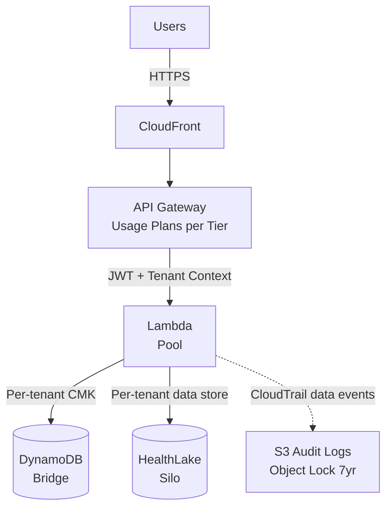

# SaaS Architecture Artifacts

## Overview

As a SaaS architect, you should produce concrete deliverables — not just advice. When the conversation reaches a decision point or the user asks for a recommendation, offer to generate the relevant artifact as a markdown file in their workspace.

Always ask the user where they want artifacts saved. Default suggestion: `docs/saas-architecture/` in the workspace root.

This file covers the **core SaaS artifacts** — those that apply to any multi-tenant SaaS on AWS. For healthcare-specific artifacts (HIPAA Eligibility Matrix, PHI Data Flow Map, BAA Inventory, Audit Log Coverage Matrix, HITRUST Control Inheritance, De-identification Strategy, Break-the-Glass Runbook), load `artifacts-healthcare.md`.

## Artifact Relationships

Artifacts overlap. When generating multiple artifacts, be aware of how they connect to avoid redundancy:

**Tenant Isolation Matrix ↔ Data Partitioning Map:**
The Isolation Matrix includes a high-level storage column per service. The Data Partitioning Map goes deeper on storage specifics (key design, backup strategy, migration paths). If both are generated, the Data Partitioning Map should reference the Isolation Matrix for the tenancy model decisions and focus on storage implementation details. Don't repeat the same service-level table in both.

**Tenant Isolation Matrix ↔ Tiering Matrix:**
The Isolation Matrix has a "Tier Mapping" section showing which services are pool/bridge/silo per tier. The Tiering Matrix covers the full tier definition (pricing, limits, features, SLA). If both exist, the Tiering Matrix should reference the Isolation Matrix for infrastructure details and focus on the business/product dimensions of tiers.

**Onboarding Flow ↔ Tenant Isolation Matrix:**
The Onboarding Flow's provisioning steps are determined by the tenancy model in the Isolation Matrix. If the Isolation Matrix exists, the Onboarding Flow should reference it and focus on the orchestration sequence, error handling, and per-tier variations.

**Cost Attribution Strategy ↔ Tiering Matrix:**
The Cost Attribution Strategy's metering dimensions should align with the Tiering Matrix's billing dimensions. If both exist, cross-reference them and flag any misalignment (e.g., a billing dimension that isn't being metered).

**SaaS Lens Review Report ↔ Everything:**
The Review Report may reference gaps that other artifacts would fill. For example, a finding of "no documented isolation strategy" naturally leads to generating a Tenant Isolation Matrix. When generating a Review Report, note which artifacts would address which findings in the roadmap section.

**High-Level Design ↔ Everything:**
The HLD is the top-level synthesis artifact. It references every other artifact for detail rather than duplicating content. Generate the HLD early to establish the system view, then produce detail artifacts (Isolation Matrix, PHI Flow Map, ADRs, etc.) to deepen specific sections. When an HLD exists in the workspace, every other artifact should cross-reference it so readers can navigate from system view to detail and back.

**High-Level Design ↔ Low-Level Design (LLD):**
The HLD lists components at one paragraph each; each significant component gets its own LLD. LLDs are deeper, per-component design documents covering internal structure, public API contracts, data model, algorithms, sequence diagrams, tenant isolation implementation, audit event emission, and (for GxP) requirement-to-test traceability. The HLD is the doorway; each LLD is the room. Always generate the HLD before any LLD so the component has its system context. See `artifacts-lld.md` for the full LLD template and readiness rules — this file carries only the pointer entry (Artifact 9 below).

**General rule:** When generating an artifact and a related artifact already exists in the workspace, read it first and reference it rather than duplicating content. If the existing artifact is outdated based on the current conversation, offer to update it.


## Artifact 1: Tenant Isolation Matrix

This is the single most important artifact in a SaaS engagement. It maps every service to its tenancy model, isolation mechanism, and data strategy.

Generate this after the tenancy model discussion is complete.

### Template

```markdown
# Tenant Isolation Matrix

Generated: {date}
Product: {product name}

## Service-Level Tenancy Decisions

| Service | Tenancy Model | Compute | Storage | Isolation Mechanism | Rationale |
|---------|--------------|---------|---------|-------------------|-----------|
| {service} | Pool/Bridge/Silo | Lambda/ECS/EKS | DynamoDB/RDS/S3 | {IAM dynamic policies / ABAC / RLS / Resource separation} | {why this model for this service} |

## Isolation Enforcement Details

### {Service Name}
- **Tenancy model:** {Pool/Bridge/Silo}
- **Compute isolation:** {How compute is isolated or shared}
- **Storage isolation:** {How data is partitioned}
- **IAM strategy:** {Static policies / Dynamic STS / ABAC / N/A}
- **Data access pattern:** {How tenant context scopes queries}
- **Cross-tenant access prevention:** {Specific mechanism}
- **Isolation testing approach:** {How isolation is validated}

## Tier Mapping

| Tier | Services in Pool | Services in Bridge | Services in Silo |
|------|-----------------|-------------------|-----------------|
| Basic | {list} | {list} | - |
| Professional | {list} | {list} | {list} |
| Enterprise | {list} | {list} | {list} |

## Open Questions / Risks
- {Any unresolved decisions}
- {Known risks with chosen approach}

## Related Artifacts
<!-- If data-partitioning-map.md exists, reference it for storage implementation details instead of repeating here -->
<!-- If tiering-matrix.md exists, reference it for full tier definitions instead of duplicating tier details -->
```

### When to Generate
- After completing the tenancy model discussion for all services
- When the user asks "what should our isolation look like?"
- When doing an architecture review and documenting current state

## Artifact 2: High-Level Design (HLD)

The HLD is the top-level synthesis artifact — a single system view that ties together the specialized artifacts (Isolation Matrix, PHI Flow Map, ADRs, etc.) into a coherent architecture document. It answers "what does the whole system look like?" for audiences that need the system view before they dig into detail: enterprise customer security teams, compliance reviewers, new engineers joining the team, auditors, and (for GxP) validation reviewers.

**Think of HLD as the doorway; specialized artifacts are the detail behind the door.** The HLD should reference other artifacts for depth, not duplicate their content.

For GxP-regulated systems, the HLD serves as the "System Description" document required by `gxp-compliance-generic.md`. The GxP variant includes additional sections for safety classification, GAMP 5 categorization summary, and validation scope.

### Template

```markdown
# High-Level Design

**Product:** {product name}
**Date:** {date}
**Version:** {version}
**Segment:** {digital health/telehealth | EHR-adjacent/clinical workflow | clinical SaaS/imaging | payer tech}
**Regulatory Scope:** {HIPAA} + {HITRUST | 42 CFR Part 2 | FDA/SaMD | GxP | none}
**Authors:** {names}

## 1. Executive Summary

{One paragraph, 4-6 sentences: what the product does, who uses it, what problem it solves, the key architectural choices (tenancy model, primary AWS services, compliance posture), and any notable constraints. This is what a busy executive or security reviewer reads first.}

## 2. System Context

### Users and Personas
| Persona | Description | Authentication | Primary Use Cases |
|---------|-------------|---------------|-------------------|
| {e.g., Clinician} | {description} | {SAML from health system IdP / Cognito / SMART on FHIR} | {what they do} |
| {e.g., Patient} | {description} | {Cognito + MFA} | {what they do} |
| {e.g., Org Admin} | {description} | {Cognito + MFA} | {what they do} |

### External Systems
| System | Integration Type | Protocol | Direction |
|--------|-----------------|----------|-----------|
| {e.g., Epic EHR} | {SMART on FHIR} | {HTTPS, OAuth 2.0} | {Bidirectional} |
| {e.g., Hospital PACS} | {DICOM} | {DICOMweb / DIMSE over VPN} | {Inbound studies, outbound results} |
| {e.g., Clearinghouse} | {EDI} | {SFTP / AS2} | {Inbound claims, outbound remittances} |

### Regulatory Scope
- **HIPAA:** {how it applies — covered entity tenants, business associate tenants, or both}
- **{Additional regulation}:** {why it applies and key implications}
- **Out of scope:** {regulations explicitly not applicable and why}

## 3. Logical Architecture

### Components and Responsibilities
| Component | Responsibility | Tenancy Model | Key Dependencies |
|-----------|---------------|---------------|------------------|
| {Control Plane} | {Tenant mgmt, identity, billing, onboarding} | Shared (always) | Cognito, DynamoDB, EventBridge |
| {Application Plane — Service A} | {description} | {Pool/Bridge/Silo} | {services} |
| {Application Plane — Service B} | {description} | {Pool/Bridge/Silo} | {services} |

### Control Plane / Application Plane Boundary
{Describe the split per SBT patterns. What lives in the control plane (always shared) and what lives in the application plane (tenancy varies). How they communicate — EventBridge, direct API, etc.}

### Multi-Tenant Model Summary
{One paragraph summarizing the tenancy approach. Reference the Tenant Isolation Matrix for per-service detail.}

→ See [Tenant Isolation Matrix](./tenant-isolation-matrix.md) for per-service tenancy decisions.

## 4. Physical Architecture on AWS

### Architecture Diagram

{Mermaid diagram showing the deployed system. Use `graph TD` or `graph LR`. Include: user entry points, CloudFront/API Gateway, compute (Lambda/ECS/EKS), data stores (DynamoDB/RDS/S3/HealthLake/HealthImaging), observability (CloudTrail/CloudWatch), and key integrations. Annotate tenancy model per component.}

Example structure:


### AWS Account Structure
| Account | Purpose | OU |
|---------|---------|----|
| {Management} | {AWS Organizations root} | - |
| {Log Archive} | {Centralized audit logs} | Security |
| {Shared Services} | {Control plane} | Infrastructure |
| {Production} | {Application plane} | Workload |
| {Staging, Dev} | {Non-production} | Workload |

{For account-per-tenant silo model, add tenant OU structure. Reference `resilience-and-deployment.md` Organizations pattern.}

### Regions and Data Residency
- **Primary region:** {region and rationale}
- **DR region:** {region and RPO/RTO}
- **Data residency constraints:** {EU customer data in EU regions, state-specific requirements, etc.}

### Networking Summary
- **VPC design:** {shared VPC / VPC per tenant / bridge}
- **Ingress:** {CloudFront + WAF, API Gateway, NLB for DICOM}
- **Enterprise connectivity:** {PrivateLink for health systems, Direct Connect for high-volume imaging sites, VPN for lower-volume sites}
- **Egress:** {VPC endpoints for AWS services, no public internet for PHI traffic}

→ See `api-gateway-and-networking.md` steering for networking pattern detail.

## 5. Key Data Flows

### PHI Data Flow
{High-level paragraph describing how PHI enters, is processed, stored, and leaves the system.}

→ See [PHI Data Flow Map](./phi-data-flow-map.md) for detailed flow diagram and per-hop annotations.

### Tenant Onboarding
{One paragraph: what happens when a new tenant is created.}

→ See [Onboarding Flow](./onboarding-flow.md) for step-by-step sequence.

### Integration Flows (if applicable)
- **FHIR exchange:** {EHR launch, standalone launch, backend services} → see `fhir-and-interop.md`
- **HL7 v2 ingestion:** {how messages arrive, routing to tenants} → see `fhir-and-interop.md`
- **DICOM ingestion:** {from modalities/PACS to HealthImaging} → see `clinical-saas-and-imaging.md`
- **EDI processing:** {X12 transactions, clearinghouse integration} → see `payer-saas-patterns.md`

## 6. Security and Compliance Posture

### Tenant Isolation
{One paragraph: the isolation philosophy — where bridge/silo/pool is used, why, and how infrastructure enforces it.}

→ See [Tenant Isolation Matrix](./tenant-isolation-matrix.md) for per-service detail.

### Identity and Access
- **Identity provider:** {Cognito pattern, SAML federation for health systems, SMART on FHIR for EHR launch}
- **Personas and auth flows:** {summary — clinician SSO, patient self-service, admin MFA}
- **Break-the-glass:** {yes/no, link to runbook if yes}

→ See `identity-and-onboarding.md` steering for identity patterns.

### Encryption
- **At rest:** {per-tenant CMK strategy for PHI, AWS-managed keys for non-PHI, key rotation policy}
- **In transit:** {TLS 1.2+ everywhere, VPC endpoints, PrivateLink}

→ See `phi-data-handling.md` steering for encryption key strategy.

### Audit and Observability
- **Infrastructure audit:** {CloudTrail management + data events, retention}
- **Application audit:** {PHI access logging schema, consent tracking, storage}
- **Immutability:** {S3 Object Lock Compliance Mode, retention period}

→ See [Audit Log Coverage Matrix](./audit-log-coverage-matrix.md) for detail.

### HIPAA Eligibility and BAA Chain
- **AWS BAA:** {status}
- **Subprocessor BAAs:** {summary — any non-HIPAA-eligible services in use and why it's acceptable}

→ See [HIPAA Service Eligibility Matrix](./hipaa-service-eligibility-matrix.md) and [BAA Inventory](./baa-inventory.md).

### Additional Compliance (as applicable)
- **HITRUST:** {target CSF version, certification timeline} → see [HITRUST Control Inheritance Matrix](./hitrust-control-inheritance-matrix.md)
- **42 CFR Part 2:** {consent-gated access approach for SUD data}
- **State laws:** {CMIA, TX HB 300, NY SHIELD — summary of applicable requirements}
- **GDPR Article 9:** {EU data residency, DPIA if applicable}

## 7. Operational Characteristics

### Scalability
- **Tenant growth target:** {year 1, year 3 tenant counts}
- **Scaling approach per component:** {auto-scaling, sharding, cell-based if applicable}
- **Known scaling bottlenecks:** {and mitigation plans}

### Availability and DR
- **RPO/RTO per data tier:**
  | Tier | RPO | RTO |
  |------|-----|-----|
  | {Clinical data stores} | {< 1 hr} | {< 4 hr} |
  | {Non-clinical services} | {standard} | {standard} |
- **DR strategy:** {active-active | active-passive | single-region with backups}
- **HIPAA contingency plan:** {reference to backup, DR, emergency mode operation procedures}

### Deployment
- **CI/CD approach:** {pipeline, staged rollout, canary, blue/green}
- **Tenancy of deployments:** {all tenants same version — SaaS principle}
- **Rollback strategy:** {how it works, how it's tested}

→ See `resilience-and-deployment.md` steering for deployment patterns.

### Observability
- **Tenant-aware logging:** {tenant_id in every log, no PHI in plaintext}
- **Per-tenant metrics:** {approach — CloudWatch dimensions, EMF, etc.}
- **Noisy neighbor detection:** {alerts and thresholds}

→ See `observability-and-operations.md` steering for detail.

## 8. Key Architectural Decisions

{Summary table. Each row points to a full ADR for the rationale. This is not an ADR itself — it's the index of decisions.}

| # | Decision | Date | Status | Link |
|---|----------|------|--------|------|
| ADR-001 | {Tenancy model per service} | {date} | Accepted | [ADR-001](./adr/ADR-001-{title}.md) |
| ADR-002 | {Identity provider and SMART on FHIR approach} | {date} | Accepted | [ADR-002](./adr/ADR-002-{title}.md) |
| ADR-003 | {Data partitioning per storage service} | {date} | Accepted | [ADR-003](./adr/ADR-003-{title}.md) |

## 9. Open Questions and Risks

### Open Questions
| # | Question | Impact | Owner | Due |
|---|----------|--------|-------|-----|
| 1 | {unresolved decision or unknown} | {High/Medium/Low} | {name} | {date} |

### Known Risks
| # | Risk | Likelihood | Impact | Mitigation |
|---|------|-----------|--------|-----------|
| 1 | {risk description} | {H/M/L} | {H/M/L} | {current mitigation or planned action} |

## 10. Related Artifacts

**Always generated alongside HLD for healthcare SaaS:**
- [Tenant Isolation Matrix](./tenant-isolation-matrix.md)
- [HIPAA Service Eligibility Matrix](./hipaa-service-eligibility-matrix.md)
- [PHI Data Flow Map](./phi-data-flow-map.md)
- [BAA Inventory](./baa-inventory.md)

**Generated as needed based on context:**
- [Onboarding Flow](./onboarding-flow.md)
- [Data Partitioning Map](./data-partitioning-map.md)
- [Tiering Matrix](./tiering-matrix.md)
- [Cost Attribution Strategy](./cost-attribution-strategy.md)
- [Audit Log Coverage Matrix](./audit-log-coverage-matrix.md)
- [Break-the-Glass Runbook](./break-the-glass-runbook.md)
- [HITRUST Control Inheritance Matrix](./hitrust-control-inheritance-matrix.md)
- [De-identification Strategy](./de-identification-strategy.md)
- Individual ADRs for significant decisions

**For GxP-regulated systems, additional sections (see "GxP Variant" below).**
```

### GxP Variant — Additional Sections

When the system is GxP-regulated (SaMD, eClinical, pharmacovigilance, regulated labs), add these sections to the HLD:

```markdown
## 11. Software Safety Classification (IEC 62304)

{For SaMD only. Classify each component.}

| Component | Safety Class (A/B/C) | Rationale |
|-----------|---------------------|-----------|
| {component} | {class} | {what harm could occur if this component fails} |

**Overall product classification:** {highest class present}

## 12. GAMP 5 Categorization Summary

{High-level summary. Reference the full matrix for detail.}

| Category | Component Count | Validation Effort |
|----------|----------------|-------------------|
| Category 1 (Infrastructure) | {count} | Minimal — inherit AWS qualification |
| Category 3 (Non-configured) | {count} | IQ/OQ |
| Category 4 (Configured) | {count} | IQ/OQ/PQ |
| Category 5 (Custom) | {count} | Full lifecycle validation |

→ See [GAMP 5 Service Categorization Matrix](./gamp5-service-categorization-matrix.md) for detail.

## 13. Validation Scope

- **Validation approach:** {risk-based per GAMP 5}
- **Qualified CI/CD pipeline:** {yes/no — if yes, pipeline is itself Category 4}
- **Electronic signatures required:** {yes/no — which events, see E-Signature Design}
- **PCCP for AI (if applicable):** {in place / planned / not applicable}

→ See [Validation Plan](./validation-plan-{release}.md), [Traceability Matrix](./traceability-matrix-{release}.md), and [Supplier Qualification Register](./supplier-qualification-register.md).

## 14. Change Control

- **Change control process:** {reference to SOP}
- **Classification:** {Standard / Normal / Major / Emergency — thresholds}
- **CAB structure:** {for Major changes}

→ See [Change Control Record Template](./change-control-record-template.md).
```

### When to Generate

Generate the HLD **early in an engagement**, not at the end. The HLD is the foundational synthesis document — sketch the system view first, then go deep on specific areas via Isolation Matrix, PHI Flow Map, ADRs, etc.

Specific triggers:
- The customer describes what they're building and has at least rough answers to segment, tenancy, and AWS services
- Before any detailed deep-dive on a specific domain (isolation, PHI, onboarding, etc.) — produce the HLD first so subsequent artifacts have a home
- At the start of a new product or major new capability within an existing product
- When a new engineer or compliance reviewer needs a system overview
- When responding to enterprise customer security questionnaires or vendor reviews
- For GxP systems: before the first regulated release, as the "System Description" validation evidence
- During architecture review: updating an existing HLD to reflect current state

### Readiness Requires

Do not generate an HLD without all of these. If gaps exist, ask for them specifically (progressive discovery) before generating.

- **Segment identified** — which of the four healthcare SaaS segments
- **Regulatory scope clear** — HIPAA (assumed), plus HITRUST, 42 CFR Part 2, FDA/SaMD, GxP as applicable
- **User personas identified** — at minimum 2-3 primary personas with authentication approach
- **External integrations known** — which EHRs, payers, labs, devices the system connects to
- **Component list exists** — rough list of services/components (even "API, background processor, dashboard" is enough to start)
- **Tenancy model decided per major component** — or enough context to recommend one (Isolation Matrix exists or can be generated alongside)
- **AWS services selected** — at least the primary ones (compute, storage, identity, FHIR/imaging if applicable)
- **Account structure decided** — single account, multi-account, or account-per-tenant

**For the GxP variant additionally:**
- IEC 62304 safety classification complete (if SaMD)
- GAMP 5 categorization approach agreed
- Validation strategy decided (continuous vs point-in-time)

If any of these are missing, the HLD will have gaps. Ask for them rather than filling with "TBD."

### Relationship to Other Artifacts

The HLD is the synthesis document. Always reference, never duplicate:
- **Tenant Isolation Matrix** — HLD summarizes the tenancy philosophy; Isolation Matrix has per-service detail
- **PHI Data Flow Map** — HLD shows high-level data flow; PHI Flow Map has the full journey with encryption/audit at each hop
- **HIPAA Service Eligibility Matrix** — HLD confirms HIPAA posture; Eligibility Matrix has per-service validation
- **BAA Inventory** — HLD references BAA chain; BAA Inventory has the full list and gaps
- **Onboarding Flow** — HLD describes onboarding at one paragraph; Onboarding Flow has the step-by-step
- **Audit Log Coverage Matrix** — HLD references audit approach; Audit Matrix has per-event-type detail
- **ADRs** — HLD has a decision index; each ADR has the full rationale
- **Data Partitioning Map** — HLD references storage approach; Data Partitioning Map has per-service key design and backup strategy
- **Low-Level Designs (LLDs)** — HLD lists components at one paragraph each; each significant component has its own LLD (`artifacts-lld.md`) covering internal structure, API contracts, data model, algorithms, sequence diagrams, tenant isolation implementation, and (for GxP) traceability
- **For GxP:** HLD summarizes safety class and GAMP 5 categorization; full matrices have per-component detail

**Updating the HLD:** When a specialized artifact is generated or updated, check whether the HLD needs to be updated to reflect the new detail. The HLD is a living document — offer to update it when architecture decisions change.

## Artifact 3: Architecture Decision Record (ADR)

Generate an ADR for each significant architecture decision. ADRs document the why behind decisions — critical for future team members and for audit trails.

### Template

```markdown
# ADR-{number}: {Title}

**Date:** {date}
**Status:** Proposed | Accepted | Superseded
**Deciders:** {who was involved}

## Context

{What is the situation? What problem are we solving? What constraints exist?}

## Decision

{What did we decide? Be specific.}

## Rationale

{Why this option over alternatives? Reference AWS best practices where applicable.}

## Alternatives Considered

### Option A: {name}
- **Description:** {what it is}
- **Pros:** {advantages}
- **Cons:** {disadvantages}
- **Why rejected:** {specific reason}

### Option B: {name}
- **Description:** {what it is}
- **Pros:** {advantages}
- **Cons:** {disadvantages}
- **Why rejected:** {specific reason}

## Consequences

### Positive
- {benefit 1}
- {benefit 2}

### Negative (accepted trade-offs)
- {trade-off 1}
- {trade-off 2}

### Risks
- {risk 1 and mitigation}
- {risk 2 and mitigation}

## References
- {AWS whitepaper or blog post that supports this decision}

## Related Artifacts
<!-- Reference related ADRs, Isolation Matrix, or other artifacts that informed or are affected by this decision -->
```

### When to Generate
- After any significant tenancy model decision
- After choosing an isolation strategy
- After selecting a data partitioning approach
- After deciding on compute model
- When the user says "let's document this decision"

### Common ADR Topics for SaaS
- Tenancy model selection (per service or overall)
- Tenant isolation strategy
- Identity provider and multi-tenant auth approach
- Data partitioning strategy per storage service
- Control plane vs. application plane boundary
- Tiering and throttling strategy
- Cost attribution approach
- CI/CD and deployment strategy
- Multi-account vs. single-account decision
- Cell-based architecture adoption


## Artifact 4: SaaS Lens Review Report

Generate this after conducting a SaaS Lens review using the saas-lens-review.md steering file.

### Template

```markdown
# SaaS Lens Architecture Review

**Product:** {product name}
**Date:** {date}
**Reviewer:** {name}
**Review scope:** {what was reviewed}

## Executive Summary

{2-3 sentences: overall SaaS maturity level, top risks, key strengths}

**Overall Maturity:** {Early / Developing / Mature}

## Findings Summary

| # | Pillar | Finding | Risk Level | Effort | Priority |
|---|--------|---------|------------|--------|----------|
| 1 | {pillar} | {one-line finding} | Critical/High/Medium/Low | Low/Medium/High | P1/P2/P3/P4 |

## Detailed Findings

### Finding {number}: {title}

**Pillar:** {Operational Excellence / Security / Reliability / Performance / Cost Optimization}
**Risk Level:** {Critical / High / Medium / Low}

**Current State:**
{What was observed}

**Risk:**
{What could go wrong if not addressed}

**Recommendation:**
{What to do, with specific AWS guidance}

**Effort:** {Low / Medium / High}
**Priority:** {P1 / P2 / P3 / P4}

**Reference:** {Link to relevant AWS documentation}

## Quick Wins

{3-5 low-effort, high-impact improvements}

1. {Quick win with expected impact}
2. {Quick win with expected impact}
3. {Quick win with expected impact}

## Recommended Roadmap

### Phase 1: Critical (Weeks 1-4)
- {Finding X: action}
- {Finding Y: action}

### Phase 2: High Priority (Weeks 5-12)
- {Finding X: action}
- {Finding Y: action}

### Phase 3: Improvements (Weeks 13+)
- {Finding X: action}
- {Finding Y: action}

## Strengths Observed
- {What the team is doing well}
- {Existing good practices to maintain}
```

### When to Generate
- After completing a SaaS Lens review walkthrough
- When the user asks for an architecture assessment
- When the user says "review our architecture"

## Artifact 5: Onboarding Flow

Generate a tenant onboarding sequence showing every step from signup to first use.

### Template

```markdown
# Tenant Onboarding Flow

**Product:** {product name}
**Date:** {date}

## Onboarding Sequence

### Trigger
{How onboarding starts: API call, self-service signup, admin action}

### Steps

| Step | Action | Service | Failure Handling |
|------|--------|---------|-----------------|
| 1 | Create tenant record | Control Plane | Rollback: delete record |
| 2 | Provision identity | {Cognito / custom} | Rollback: delete user pool/user |
| 3 | Provision storage | {DynamoDB / RDS / S3} | Rollback: delete resources |
| 4 | Configure routing | {API GW / Route 53} | Rollback: remove route |
| 5 | Set up billing | {Billing service} | Rollback: remove billing profile |
| 6 | Apply tier limits | {API GW usage plan} | Rollback: remove usage plan |
| 7 | Send activation | {SES / SNS} | Retry |

### Orchestration
- **Engine:** {Step Functions / custom}
- **Estimated duration:** {seconds/minutes}
- **Retry strategy:** {per-step retry with exponential backoff}
- **Compensation:** {rollback steps on failure}

### Mermaid Diagram

{Generate a mermaid sequence diagram showing the flow}

## Per-Tier Variations

| Step | Basic (Pool) | Professional (Bridge) | Enterprise (Silo) |
|------|-------------|----------------------|-------------------|
| Provision storage | Skip (shared) | Create schema/table | Create instance/account |
| Configure routing | Skip (shared) | Update routing table | Create dedicated endpoint |
| Estimated time | ~5 seconds | ~30 seconds | ~5 minutes |
```

### When to Generate
- After discussing onboarding requirements
- When the user asks "how should onboarding work?"
- After tenancy model and identity decisions are made


## Artifact 6: Data Partitioning Map

Generate a per-service breakdown of storage decisions.

### Template

```markdown
# Data Partitioning Map

**Product:** {product name}
**Date:** {date}

## Storage Decisions by Service

### {Service Name}

| Aspect | Decision |
|--------|----------|
| Storage service | {DynamoDB / RDS Aurora PostgreSQL / S3} |
| Partitioning model | {Pool / Bridge / Silo} |
| Tenant key design | {e.g., PK: TENANT#id, SK: ORDER#id} |
| Isolation mechanism | {IAM LeadingKeys / RLS / Separate tables / Separate schemas} |
| Backup strategy | {Per-tenant / Shared / Point-in-time} |
| Right-to-erasure | {Delete by PK scan / Drop schema / Delete table} |
| Scaling approach | {Auto-scaling / Sharding / Read replicas} |
| Estimated data volume | {per tenant and total} |

## Cross-Service Data Flow

{How data moves between services, with tenant context preserved}

## Migration Path

{How a tenant's data moves if they change tiers}
- Pool → Bridge: {steps}
- Bridge → Silo: {steps}

## Related Artifacts
<!-- If tenant-isolation-matrix.md exists, reference it for tenancy model decisions instead of repeating here -->
<!-- If onboarding-flow.md exists, reference it for provisioning steps that create these storage resources -->
```

### When to Generate
- After data partitioning discussion is complete
- When the user asks about database design for multi-tenant

## Artifact 7: Tiering Matrix

### Template

```markdown
# Tiering Matrix

**Product:** {product name}
**Date:** {date}

## Tier Definitions

| Dimension | {Tier 1 name} | {Tier 2 name} | {Tier 3 name} |
|-----------|--------------|--------------|--------------|
| **Price** | {price} | {price} | {price} |
| **Tenancy model** | Pool | Pool/Bridge | Silo |
| **API rate limit** | {X req/min} | {X req/min} | {X req/min or custom} |
| **API burst limit** | {X} | {X} | {X} |
| **Storage quota** | {X GB} | {X GB} | {Unlimited} |
| **Users/seats** | {X} | {X} | {Unlimited} |
| **Data retention** | {X days} | {X days} | {Custom} |
| **Support** | {Community} | {Email} | {Dedicated} |
| **SLA** | {X%} | {X%} | {X%} |
| **Features** | {list} | {list} | {list} |

## Throttling Enforcement

| Tier | API Gateway Usage Plan | Application-Level Limits | Database Limits |
|------|----------------------|-------------------------|----------------|
| {tier} | {rate/burst/quota} | {specific limits} | {connection/throughput limits} |

## Upgrade Path
- {Tier 1} → {Tier 2}: {what changes, any migration needed}
- {Tier 2} → {Tier 3}: {what changes, any migration needed}

## Billing Dimensions (if Marketplace)
| Dimension | Unit | Included in Base | Overage Rate |
|-----------|------|-----------------|-------------|
| {dimension} | {unit} | {amount per tier} | {rate} |
```

### When to Generate
- After tiering discussion
- When the user asks about pricing strategy mapping to infrastructure

## Artifact 8: Cost Attribution Strategy

### Template

```markdown
# Cost Attribution Strategy

**Product:** {product name}
**Date:** {date}

## Attribution by Service

| Service | Tenancy Model | Attribution Method | Metrics Captured | Attribution Accuracy |
|---------|--------------|-------------------|-----------------|---------------------|
| {service} | Pool | Usage-based apportionment | API calls, compute duration | Approximate |
| {service} | Silo | Resource tagging | AWS Cost Explorer | Exact |
| {service} | Bridge | Hybrid (tags + usage) | Storage: exact, Compute: approximate | Mixed |

## Metering Pipeline

### Captured Metrics
| Metric | Source | Granularity | Storage |
|--------|--------|-------------|---------|
| {metric} | {where captured} | {per-request / hourly / daily} | {DynamoDB / Timestream / CloudWatch} |

### Pipeline Architecture
{Description of metering flow: capture → transport → aggregate → store → consume}

## Cost Allocation Tags
| Tag Key | Applied To | Purpose |
|---------|-----------|---------|
| TenantId | {resources} | Per-tenant cost tracking |
| TenantTier | {resources} | Tier-level cost analysis |
| Service | {resources} | Per-service cost breakdown |

## Reporting
- **Per-tenant cost report:** {frequency, tool}
- **Margin analysis:** {how revenue vs. cost is compared}
- **Anomaly detection:** {how cost spikes per tenant are detected}

## Related Artifacts
<!-- If tiering-matrix.md exists, verify metering dimensions align with billing dimensions defined there -->
<!-- If tenant-isolation-matrix.md exists, reference it for which services are pool/bridge/silo -->
```

### When to Generate
- After cost attribution discussion
- When the user asks about measuring cost per tenant


## Artifact 9: Low-Level Design (LLD)

The LLD is the component-level design document — one per significant component listed in the HLD. Where the HLD answers "what does the whole system look like?", an LLD answers "how is *this component* built?"

**Think of it this way:** HLD is the doorway. Each LLD is the room behind a specific door. A healthcare SaaS typically has 10-20 LLDs across its services (Patient Service, FHIR Ingestion Pipeline, Imaging Orchestrator, Consent Service, etc.) — each a focused document that a developer reads before writing code, and a reviewer reads to verify the code matches intent.

**This entry is a pointer.** The full LLD template, GxP variant (IEC 62304 safety class, GAMP 5 categorization, traceability, electronic signatures, formal approval), readiness rules, relationships to every upstream artifact, and naming conventions all live in `artifacts-lld.md`. Load that file whenever the user asks for component-level design.

### What an LLD Covers

- **Purpose and scope** of the component + parent context inherited from the HLD (segment, regulatory scope, tenancy model, GAMP 5 category if GxP)
- **Internal structure** — modules/classes with responsibilities and a Mermaid diagram
- **Public API contract** — endpoints, request/response schemas, errors, idempotency, rate limits, SLA; or events consumed/published
- **Data model** — schema, access patterns, PHI field-level handling, caching
- **Key interactions** — sequence diagrams for the flows that touch PHI, span services, or have non-trivial error handling
- **Tenant isolation implementation** — context propagation, IAM session policies, repository-layer assertions, isolation failure modes
- **Algorithms and business logic** — pseudocode for non-trivial logic (consent evaluation, idempotency, retry/backoff)
- **Error handling and resilience** — error taxonomy, retry strategy, circuit breaker, saga compensation
- **Security and compliance implementation** — PHI handling, authN/authZ, audit events emitted, electronic signatures (GxP)
- **Observability** — structured logging, per-tenant metrics, traces
- **Scaling and performance budget** — expected load, noisy-neighbor handling, p50/p99 targets
- **Testing strategy** — unit, integration, contract, tenant isolation, performance
- **Deployment** — IaC path, rollout strategy, runbook references, configuration
- **Dependencies** — internal components, AWS services, third-party libraries
- **GxP additions** — IEC 62304 safety class, GAMP 5 categorization with IQ/OQ/PQ scope, traceability (URS → design → test), change control, e-signature design, formal approval signatures

### When to Generate

- A new component is being added and needs design before code is written
- An existing component is being substantially refactored
- A GxP-regulated component needs a Design Specification (DS) for validation evidence
- A new engineer is taking ownership of a component and needs to understand how it works internally
- Security or compliance review needs component-level detail (consent enforcement, PHI handling, audit emission)
- The HLD describes a component at one paragraph, but the team needs implementation decisions that aren't obvious from the HLD

Do **not** generate an LLD for:
- Trivial glue code or one-function Lambdas fully described by their IaC and a one-line purpose
- Components that are pure configuration of a managed service with no custom logic (document in Data Partitioning Map or HLD instead)
- Third-party components the team doesn't own

### Prerequisites

- **HLD must exist** (or be generated alongside). An LLD without an HLD has no context for its constraints.
- Component must appear in the HLD's Components and Responsibilities table under the name used in the LLD filename.
- For GxP components: GAMP 5 category assigned and IEC 62304 safety class complete.

### Readiness Requires

See `artifacts-lld.md` "Readiness Requires" section for the full checklist. At minimum: HLD exists, component identified, component responsibility clear, public API shape known, primary data store chosen, tenancy model decided, authN/authZ model decided, PHI handling known (if applicable), audit events known.

### Relationship to Other Artifacts

LLDs reference upward — they never re-derive decisions from higher artifacts:
- **HLD** — for system context, segment, regulatory scope, account structure
- **Tenant Isolation Matrix** — for the component's tenancy model and isolation mechanism
- **Data Partitioning Map** — for storage-level key design
- **PHI Data Flow Map** — for the PHI flow hops this component participates in
- **ADRs** — for decisions with broader rationale
- **Audit Log Coverage Matrix** — bi-directional; events emitted by the LLD must appear in the matrix
- **GAMP 5 Matrix, Validation Plan, Traceability Matrix** — for GxP components

When an LLD and another artifact disagree, the LLD loses — the higher artifacts are authoritative.

### Naming Convention

- `docs/saas-architecture/lld/{component-name}.md` (kebab-case, match the HLD Components table entry)
- For GxP components under formal change control, version the filename per release: `lld/{component-name}-v1.2.md`

### See Also

Full template, GxP variant, detailed readiness rules, and usage guidance: `artifacts-lld.md`.

These rules apply to **all** artifacts — SaaS and healthcare. The healthcare artifacts in `artifacts-healthcare.md` inherit these rules.

**Do NOT ask all questions upfront like a form.** Instead, use progressive discovery:

1. Have a natural conversation. Learn about the user's context incrementally.
2. When you offer an artifact (or the user requests one), mentally check: "Do I have enough to produce this completely?"
3. If information is missing, ask only the specific gaps — not a full questionnaire. Frame it naturally: "Before I generate the isolation matrix, I need to know a couple more things about your order service..."
4. Then generate the artifact with no gaps or placeholders.

### Required Information Per SaaS Artifact (Check Before Generating)

**High-Level Design (HLD)** requires:
- Segment identified (digital health/telehealth, EHR-adjacent, clinical SaaS, payer tech)
- Regulatory scope clear (HIPAA + any additional: HITRUST, 42 CFR Part 2, FDA/SaMD, GxP)
- User personas identified (minimum 2-3 primary personas with auth approach)
- External integrations known (EHRs, payers, labs, devices)
- Component list exists (rough is fine)
- Tenancy model decided per major component (or will be decided alongside HLD generation)
- AWS services selected (at least primary compute, storage, identity)
- Account structure decided
- For GxP variant: IEC 62304 classification complete, GAMP 5 categorization approach agreed

**Low-Level Design (LLD)** requires (full checklist in `artifacts-lld.md`):
- HLD exists in the workspace — or is being generated alongside (non-negotiable prerequisite)
- Component identified in the HLD's Components and Responsibilities table
- Component responsibility is clear — one paragraph the owner can stand behind
- Public API shape known — endpoints/events and their purposes (schemas can be refined during drafting)
- Primary data store chosen (from Data Partitioning Map or decidable alongside)
- Tenancy model for the component known (from Tenant Isolation Matrix)
- AuthN/authZ model decided — identity pattern, consent enforcement responsibility, break-the-glass applicability
- PHI handling (if applicable) — which fields are PHI, encryption approach, log redaction strategy
- Audit events the component emits and their retention
- For GxP variant: IEC 62304 safety class complete, GAMP 5 category assigned, URS/FS available for traceability

**Tenant Isolation Matrix** requires:
- List of services/microservices in the system
- Tenancy model decision per service (or enough context to recommend one)
- Storage service per service (DynamoDB, RDS, S3, etc.)
- Compliance/regulatory requirements
- Tier definitions (if tiering exists)

**ADR** requires:
- The specific decision being documented
- Context and constraints that led to the decision
- At least one alternative that was considered
- The rationale for choosing this option

**SaaS Lens Review Report** requires:
- Walkthrough of each pillar's questions (use saas-lens-review.md)
- Current state observations for each question
- This is gathered during the review conversation itself

**Onboarding Flow** requires:
- Tenancy model (determines what gets provisioned)
- Identity approach (Cognito pattern, SSO requirements)
- What resources need provisioning per tier
- Billing/metering integration points

**Data Partitioning Map** requires:
- List of services and their storage services
- Tenancy model per service
- Key design decisions (partition keys, schema strategy)
- Backup and right-to-erasure requirements

**Tiering Matrix** requires:
- Tier names and target customer segments
- Features per tier
- Throttling limits per tier
- Tenancy model per tier
- Pricing (even rough ranges)

**Cost Attribution Strategy** requires:
- Which services are pool vs. silo vs. bridge
- What usage metrics matter for billing
- Whether AWS Marketplace integration is planned

For healthcare-specific artifact readiness requirements (HIPAA Eligibility Matrix, PHI Data Flow Map, BAA Inventory, etc.), see `artifacts-healthcare.md`.

### Hard Rules for Artifact Quality (Apply to All Artifacts)

**HARD RULE: Do not generate an artifact if you lack the required information.**

If you check readiness and find gaps:
1. Tell the user what's missing and why it matters: "I can't generate a useful isolation matrix yet — I don't know what storage each service uses, and that determines the isolation mechanism."
2. Ask the specific missing questions.
3. Only generate after the gaps are filled.

**Never do any of these:**
- Fill gaps with generic content ("TBD", "to be determined", "depends on requirements")
- Guess at answers the user hasn't provided
- Generate a partial artifact and say "we can fill in the rest later"
- Use boilerplate from the templates without customizing to this specific customer

**If the user insists on generating before you have enough info**, explain what will be incomplete and mark those sections explicitly as "NEEDS INPUT: {what's missing and why}" so the document is honest about its gaps rather than silently generic.

**The quality bar: every artifact should be specific enough that a developer on the customer's team can read it and take action without needing to ask "but what does this mean for our system?"**

## Agent Behavior for Artifacts

### When to Offer Artifacts

- After a significant decision is made in conversation, say: "Want me to generate an ADR for this decision?"
- After completing a domain discussion, say: "I can produce a {Tenant Isolation Matrix / Data Partitioning Map / etc.} documenting what we discussed. Want me to create that?"
- After a SaaS Lens review, say: "Let me generate the review report with findings and recommendations."
- When the user asks "what should I document?" — suggest the relevant artifacts.

### How to Generate

1. Ask the user where to save: "Where should I save architecture artifacts? I'd suggest `docs/saas-architecture/`"
2. Generate the file using the template, filled with the specific decisions from the conversation
3. Use concrete details from the discussion — never leave template placeholders unfilled
4. After generating, summarize what was created and suggest next steps

### Naming Convention

- HLD: `docs/saas-architecture/high-level-design.md` (or `high-level-design-{version}.md` for versioned releases)
- LLDs: `docs/saas-architecture/lld/{component-name}.md` (one file per component; see `artifacts-lld.md`)
- ADRs: `docs/saas-architecture/adr/ADR-001-{title}.md`
- Isolation Matrix: `docs/saas-architecture/tenant-isolation-matrix.md`
- Review Report: `docs/saas-architecture/saas-lens-review-{date}.md`
- Onboarding Flow: `docs/saas-architecture/onboarding-flow.md`
- Data Partitioning: `docs/saas-architecture/data-partitioning-map.md`
- Tiering Matrix: `docs/saas-architecture/tiering-matrix.md`
- Cost Attribution: `docs/saas-architecture/cost-attribution-strategy.md`

Healthcare artifact naming conventions are defined in `artifacts-healthcare.md`.
